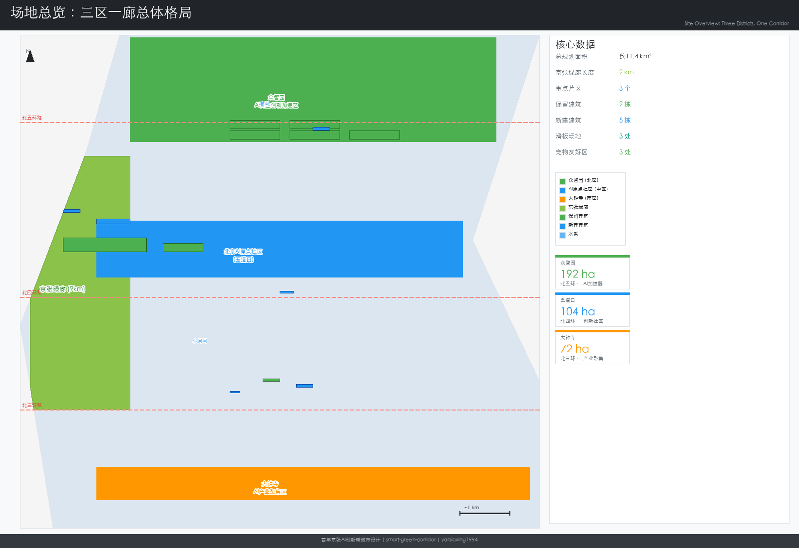
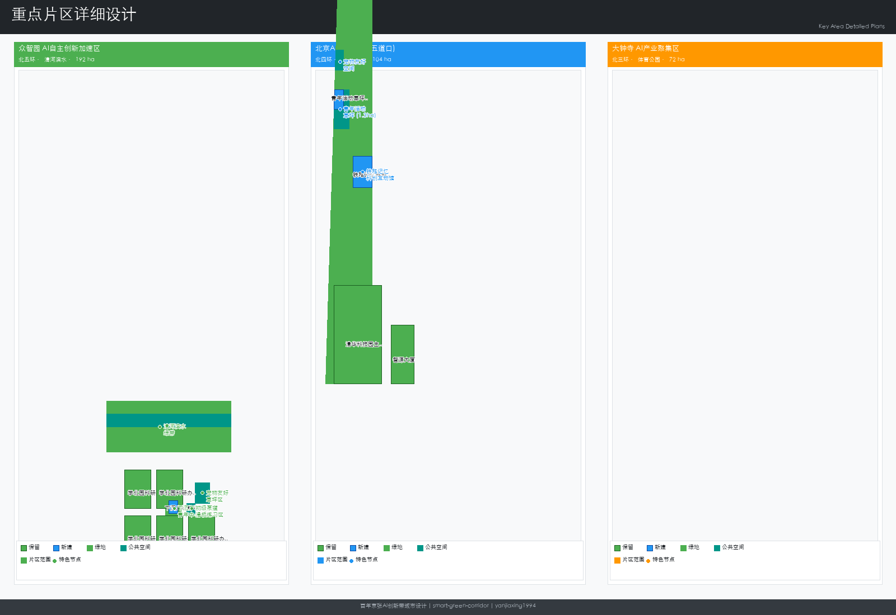
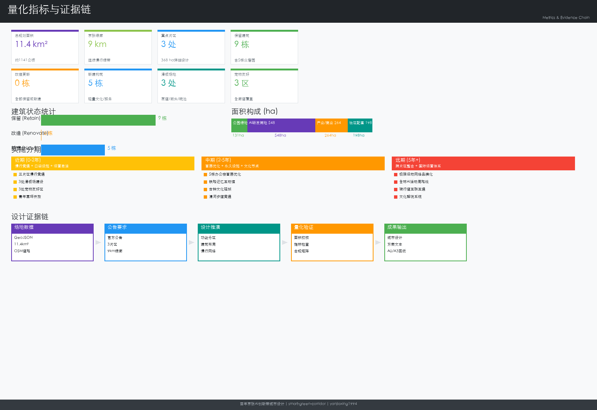
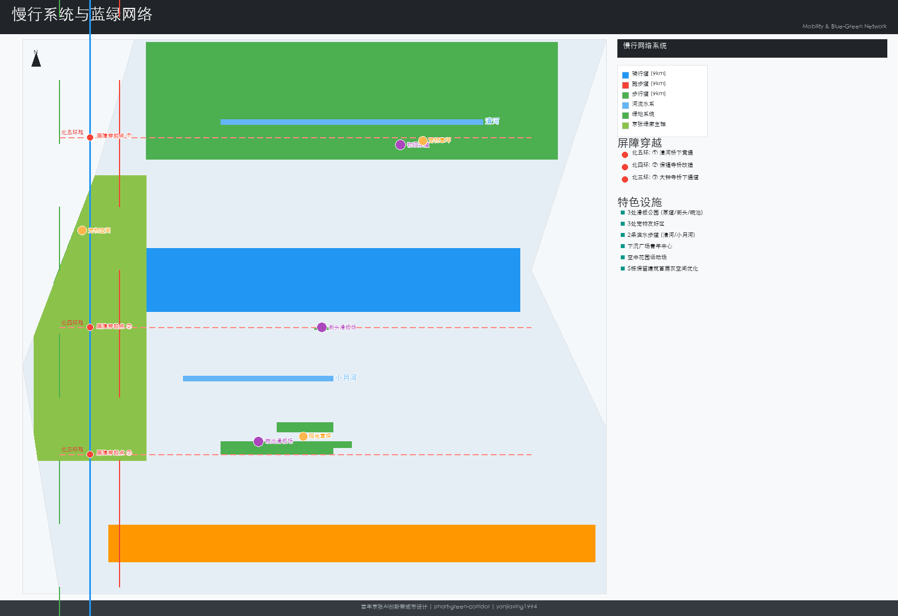

# 百年京张AI创新带城市设计 — 微更新·强链接·青年友好

## 设计依据与资料清单

本方案以北京市规划和自然资源委员会海淀分局发布的《百年京张AI创新带城市设计国际方案征集资格预审公告》为第一依据 。以 `brief/site-package/` 中 provisional boundary、enums、ranges、sources 为机器可读依据 。完整来源和标准覆盖见 `sources.json`、`standard_matrix.json`、`design_depth_matrix.json` 。本方案使用 `provisional_constraint` boundary，仅用于方案生成与设计讨论 。

证据引用：[source:OFFICIAL-ANNOUNCEMENT] [source:AGENT-TASKBOOK] [depth:existing_conditions_diagnosis]

[source:DATA-SRC-PROVISIONAL-BOUNDARIES-20260605]

## 三层范围工作框架

方案按照公告确定的三个层次组织工作：统筹研究范围关注43.6平方公里的AI产业生态、战略定位、创新链和未来城市形态；总体设计范围关注11.4平方公里京张遗址公园周边1-2公里城市地区和产业区，形成城市更新总体框架、产业空间布局、交通市政支撑和城市风貌控制；重点区域范围关注368.4公顷三处详细设计地区，明确功能业态、建筑规模、拆改留分类、公共空间连通和交通组织。三层范围的深度项由 [depth:three_level_scope_framework] 约束，空间证据以 [data:geometry/site_boundary.geojson#SITE-001] 为准。本方案将三层框架转化为"一带三核、多点场景、蓝绿慢行复合环"的空间结构，三核对应众智园、五道口和大钟寺三处重点片区，多点场景对应AI+公共服务和运动设施节点。各层设计任务在 `compliance_matrix.json` 中逐条映射 [standard:PROJECT-OFFICIAL-ANNOUNCEMENT]。

方案按公告三层范围组织：统筹研究范围（43.6km²）、总体设计范围（11.4km²）、重点区域范围（368.4ha三处）。详见下文各片区详细设计和合规矩阵 [depth:three_level_scope_framework] [depth:overall_spatial_structure]。

## 统筹研究范围产业与未来城市研究

统筹研究范围的核心任务是构建世界级AI创新生态体系。方案梳理海淀高校院所、头部企业、算力算法数据要素、孵化平台和科技服务资源，建立"高校策源-开源协作-企业转化-公共体验-国际传播"的创新链空间协同框架 [source:AGENT-TASKBOOK]。未来城市形态研究围绕AI如何改变工作、生活、社交、交通和公共服务展开，将AI交通系统、连续绿色空间和创新服务设施落实为可定位的功能区和场景节点。本方案面向青年AI人才的研发办公、开源协作、成果发布、运动社交和休闲需求提出空间响应，并以青年极限运动网络、宠物友好体系和慢行贯通作为可感知的城市更新抓手。产业战略指标、AI创新指数和人才密度与空间供给类型的对应关系写入指标体系 [standard:PROJECT-OFFICIAL-ANNOUNCEMENT]。

统筹研究构建世界级AI创新生态体系，建立"高校策源-开源协作-企业转化-公共体验-国际传播"创新链 [source:AGENT-TASKBOOK] [standard:PROJECT-OFFICIAL-ANNOUNCEMENT]。未来城市形态研究回答AI如何改变工作、生活、社交、交通和公共服务，落实为可定位的功能区和场景。


## 一、设计总纲

### 1.1 核心理念

本方案以**"微更新、强链接"**为核心理念，反对大拆大建，主张通过精准的针灸式介入，最大化保留与复用各片区现有建筑、公园绿地和文化遗存，将有限资源集中投入到慢行贯通、灰空间激活、口袋设施植入和运营机制设计中。

**三大原则：**

| 原则 | 内涵 | 空间落点 |
|------|------|----------|
| **最大化保留与复用** | 保留全部高质量科研办公建筑、现有公园绿地、铁路遗存和原生植被 | 保留建筑15栋、保留公园5处 |
| **青年友好导向** | 以AI从业者、高校学生、创业者的运动、社交、通勤、休闲需求为核心设计参数 | 三片区分类型滑板场、11处新公共空间 |
| **蓝绿生态贯通** | 沿京张铁路遗址公园9公里城市绿廊实现三片区生态与慢行系统连续贯通 | 骑行道+跑步道+漫步道"三道一绿"全线9km |

。

证据引用：[source:OFFICIAL-ANNOUNCEMENT] [source:AGENT-TASKBOOK] [depth:existing_conditions_diagnosis]

[standard:PROJECT-OFFICIAL-ANNOUNCEMENT]

### 1.2 拆改留总清单

| 类别 | 数量 | 说明 |
|------|------|------|
| **保留建筑** | 15栋 | 众智园5栋科研楼、清华科技园主楼群、智源大厦、东升大厦、大钟寺体育公园服务中心，以及5处现状公园绿地 |
| **改造空间** | 8处 | 众智园首层灰空间优化（5栋）、清华科技园首层开放界面、东升大厦首层商业激活、大钟寺体育公园跑道优化 |
| **新增设施** | 11处 | 铁路记忆科创互动馆、开源社区发布厅、古钟文化驿站、青年活动草坪服务站、下沉广场青年中心、碗池滑板场服务亭等，全部为轻量构筑物 |



### 1.3 数据依据与边界声明

本方案以北京市规划和自然资源委员会海淀分局发布的资格预审公告为第一依据。三处重点区的 polygon 均为 `provisional_constraint` (`official_boundary=false`)，仅用于方案生成与设计讨论。Official polygons 发布后，所有空间指标需复算 [source:DATA-SRC-PROVISIONAL-BOUNDARIES-20260605]。

完整合规矩阵保存于 `compliance_matrix.json`，来源清单见 `sources.json`，假设与缺资料清单见 `assumptions.json`。

---

## 品牌体系与视觉识别

### 英文命名

方案品牌英文名定为 **"Jing-Zhang AI Nexus"**，传达京张铁路历史轴线与AI创新节点网络的双重含义。"Nexus"（联结/枢纽）既指向铁路作为交通联结的历史角色，也指向AI创新生态中高校、企业、社区、公共空间的多维联结。

### 命名体系："一带·三核·多点"

| 层级 | 中文命名 | 英文命名 | 空间内涵 |
|------|----------|----------|----------|
| **一带** | 京张智脉共生带 | Jing-Zhang Smart Symbiotic Belt | 9公里京张铁路遗址公园绿廊，承载慢行贯通、生态连续与文化传承的复合主轴 |
| **三核·北** | 众智园·清河北岸创新港 | Zhongzhi Park — Qinghe North Bank Innovation Harbour | 以学北园为核心的花园型自主创新加速区 |
| **三核·中** | 原点社区·五道口知识溪谷 | Origin Community — Wudaokou Knowledge Valley | 以清华科技园、智源大厦、东升大厦为核心的近校型成果转化社区 |
| **三核·南** | 大钟寺·三环智慧门 | Dazhongsi — 3rd Ring Smart Gateway | 以大钟寺体育公园与顺馨园为核心的城市型智能经济活力街区 |
| **多点** | 滑板公园、宠物绿洲、开源庭院、铁路记忆廊、屋顶运动场、夜光跑道、古钟声景园、雨水花园链 | Skate Parks, Pet Oases, Open Source Courtyards, Railway Memory Gallery, Rooftop Sports Fields, Glow Track, Bell Soundscape Garden, Rain Garden Chain | 散布三片区的AI+公共服务与运动设施节点 |

### Logo 概念

Logo 以抽象的"京"字为原型：上部由两条铁路轨道截面渐变为集成电路走线形态，下部保持铁路枕木形态。色彩从工业铁灰（#5A5A5A）渐变至AI青蓝（#2B5F8A），象征从工业时代铁路枢纽到AI时代创新枢纽的历史跨越。"京"字上半部分的"亠"以铁轨截面表达，下半部分的"小"以三线并行抽象——既是"三道一绿"慢行系统的空间隐喻，也是"传承（铁路）、创新（AI）、共生（生态）"三线交织的视觉叙事。整体造型兼顾稳重与动感，适用于建筑立面、导向标识、数字屏幕与印刷品。

### 色彩体系

| 角色 | 色名 | 色值 | 应用场景 |
|------|------|------|----------|
| **主色** | 京张蓝 | #2B5F8A | 品牌主标识、骑行道路面涂装、导向系统主色、智能体测站外观 |
| **辅色** | 清河绿 | #4A8C6F | 生态标识、雨水花园解说牌、漫步道铺装点缀、绿廊植被选择指南封面 |
| **强调色** | 创新橙 | #E87830 | 运动设施标识、滑板场护栏涂装、活动海报强调色、AI交互节点界面高亮 |
| **中性色** | 铁路灰 | #5A5A5A | 建筑立面金属构件、铁轨遗存保护涂装、工业遗存解说牌底板 |
| **背景色** | 云白 | #F5F5F0 | 标识底色、信息牌背景、图纸页面背景 |

### 字体方向

- **中文标题**：思源黑体 (Source Han Sans) Bold，适用于各级标题、导向标识标题、建筑铭牌。SIL OFL 1.1开源许可，可嵌入PDF
- **中文正文**：系统无衬线字体（苹方 / Microsoft YaHei / Noto Sans SC），确保跨平台可读性
- **英文标题与数字**：Source Han Sans（与中文统一字体家族），保持中英混排视觉一致
- **数据仪表盘与代码展示**：等宽字体（JetBrains Mono / Source Code Pro，SIL OFL 1.1），用于AI场景卡技术参数、体测站数据界面和公共数据可视化

---

## 全球AI创新区案例研究

方案研究全球七个代表性AI与创新区案例，提炼其空间策略、运营机制与产业生态经验，为京张AI创新带提供对标参照与适用性分析。每个案例覆盖区位、规模、核心策略、关键数据和对京张的具体启示。

### 案例总览

| 编号 | 案例 | 区位 | 规模 | 核心策略 | 对京张启示 |
|------|------|------|------|----------|------------|
| 01 | 伦敦国王十字 | 英国伦敦 | 67英亩（约27公顷） | 工业遗产转知识街区，保留煤气罐改造为公共空间 | 铁路遗存活化+产业社区共生 |
| 02 | 波士顿肯德尔广场 | 美国剑桥 | 约1平方英里 | 全球生物技术密度最高区域，MIT-企业-社区"步行创新生态" | 15分钟步行创新圈+人才居住混合 |
| 03 | 新加坡纬壹科技城 | 新加坡 | 200公顷 | "工作-生活-玩-学"融合社区，启汇城启奥城双核驱动 | 研发-商业-居住-绿地混合编程 |
| 04 | 深圳南山科技园 | 中国深圳 | 11.5平方公里 | AI/ICT产业集群，大沙河生态长廊贯穿 | 科创走廊+河道生态缝合 |
| 05 | 首尔数字媒体城 | 韩国首尔 | 0.57平方公里 | 高密度数字产业区，垃圾山改造为创新高地 | 棕地再生+超高密度创新节点 |
| 06 | 巴塞罗那22@区 | 西班牙巴塞罗那 | 200公顷 | 工业区转型创新区，保留工业遗产肌理 | 工业地块微更新+创新与居住混合 |
| 07 | 上海西岸 | 中国上海 | 11.4公里滨江带 | 滨江工业带转型AI+艺术走廊 | 滨水工业带的AI艺术双重激活 |

### 01 伦敦国王十字 (King's Cross, London)

**区位与规模**：伦敦市中心以北，67英亩（约27公顷）混合更新区，前身为19世纪铁路货场和工业仓储区。

**核心策略**：以保留与改造为核心策略，将历史煤气罐三兄弟（Gasholder Triplets）改造为高端公寓和环状公共空间，储气罐8号导架（Gasholder No.8）改造为环形社区公园。入驻谷歌英国总部、DeepMind、中央圣马丁艺术学院（UAL）、弗朗西斯·克里克研究所，形成"科技-教育-文化"三角互促格局。公共空间先行策略——在首批建筑交付前即开放摄政运河滨步道和谷仓广场，公共生活先于商业利益建立。

**关键数据**：50栋新建与保留建筑、26英亩公共空间、20家头部科技企业入驻、4.5万名员工、每年1000万访客。

**对京张启示**：铁路工业遗存不是负担而是品牌资产。国王十字以煤气罐为公共空间IP（类比京张铁轨、信号灯、跨三环桥）；以公共空间先行建立社区认同（类比京张绿廊"三道一绿"先贯通）；大企业锚点+初创生态并存（类比众智园大企业+五道口开源社区）；高等教育机构作为全天候人流引擎（类比清华北大）。

### 02 波士顿肯德尔广场 (Kendall Square, Cambridge MA)

**区位与规模**：麻省理工学院（MIT）周边约1平方英里区域，剑桥市创新核心区。

**核心策略**："步行创新生态"——全球生物技术企业密度最高的区域，步行范围内集中MIT实验室、创业公司总部、风投机构、人才公寓和公共空间。Kendall Square Initiative提出"创新广场"概念，主张增加地面层零售、社区空间和可负担住房，避免"白天挤满创新者、夜晚变成空城"的单一功能区陷阱。MIT Kendall Square Gateway作为公共界面，将校园创新活动直接向社区敞开。

**关键数据**：120+家生物技术和AI企业、MIT校园无缝接壤、步行可达的公共空间网络、新建可负担住房比例20%。

**对京张启示**：15分钟步行创新圈是京张AI创新带的核心空间组织逻辑。五道口以清华北大为锚点，需要将"出校门即入创新社区"作为设计参数（类比MIT-Kendall关系）。人才居住混合（类比可负担住房要求）应在五道口和大钟寺片区回应。首层公共化策略（众智园首层灰空间、清华科技园首层展示窗）直接受Kendall Square首层激活策略启发。

### 03 新加坡纬壹科技城 (one-north, Singapore)

**区位与规模**：新加坡中南部，200公顷国家级研发与创新园区，由JTC Corporation主导开发，2001年启动。

**核心策略**："工作-生活-玩-学"（Work-Live-Play-Learn）四位一体融合社区。启汇城（Fusionopolis）聚焦信息通信与媒体，启奥城（Biopolis）聚焦生物医学，两核之间以one-north公园绿地、罗切斯特公园住宅区、商业街和INSEAD商学院串联。土地混合使用达到极致——同一地块内研发实验室、人才公寓、零售和托幼设施竖向叠合。强调24小时活力和"机缘际遇的碰撞"（serendipitous encounters）。

**关键数据**：200公顷混合用途、入驻400+家企业和研究机构、4.5万工作人口+住宅配套、7处公园绿地、3条地铁线接入。

**对京张启示**：研发-商业-居住-绿地"混合编程"是京张三片区的核心差异化策略。众智园的屋顶运动场+下沉社交广场+滨水慢行，五道口的青年草坪+开源发布厅+商业外摆，大钟寺的运动公园+文化驿站+社区服务，本质上都是"混合使用"思路的中国落地。纬壹的"24小时活力"理念提示京张需要夜间经济和文化活动支撑。

### 04 深圳南山科技园 (Nanshan S&T Park, Shenzhen)

**区位与规模**：深圳市南山区，11.5平方公里，中国科技部首批国家高新区之一。

**核心策略**：以深南大道和大沙河生态长廊为双轴，集聚腾讯、中兴、百度国际总部、大疆等头部企业总部和大量中小型AI/ICT企业。大沙河生态长廊（13.7公里）贯穿园区，以河道生态缝合科创空间——河岸设计骑行道、跑步道、龙舟赛道和湿地公园。深圳湾创业广场提供开放式路演和孵化空间，形成"大厂+初创"的生态梯度。

**关键数据**：11.5平方公里、13.7公里大沙河生态长廊、年产值超万亿元、国家级高新技术企业超5000家。

**对京张启示**：大沙河生态长廊与京张绿廊高度对标——都是城市级线性绿廊贯穿创新区。南山以大沙河为生态骨架的经验表明，河流/绿廊不仅是景观，更是"创新走廊"的空间组织主轴。大沙河沿线功能分段（上游科研、中游产业、下游生态休闲）启发京张"众智园研发-五道口转化-大钟寺应用"的功能梯度。

### 05 首尔数字媒体城 (DMC, Seoul)

**区位与规模**：首尔市麻浦区，0.57平方公里，前身为兰芝岛垃圾填埋场（1978-1993年运营，垃圾山高度达98m）。

**核心策略**：棕地再生为高密度数字产业区——经过10年土壤修复和沼气收集后，2002年启动建设，容积率高达4.0。集聚MBC、SBS、CJ ENM等韩国顶级媒体企业总部和数字内容研发中心。DMC文化谷（Culture Valley）提供公共放映厅、展览空间和数字艺术装置。以超高密度容纳产业功能，同时以公共文化设施维持社区开放性——DMC宣传馆和数字展馆对市民免费开放。

**关键数据**：0.57平方公里、容积率4.0+、400+家数字媒体企业、4.5万就业人口、年均访客量200万人次。

**对京张启示**：棕地再生经验对京张铁路沿线（部分桥下空间、废弃地块和道口闲置地）有参照价值。DMC的"高密度产业+公共文化设施"模式提示大钟寺片区可借鉴——在保持体育公园绿地率的同时，将文化驿站、科创互动馆等公共设施作为开发密度与公共利益的平衡点。垃圾山到创新高地20年转型周期提示京张需要长期主义和分阶段实施。

### 06 巴塞罗那22@区 (22@Barcelona)

**区位与规模**：巴塞罗那Poblenou工业区（Sant Marti区），200公顷，原为19世纪加泰罗尼亚纺织工业中心，后衰败为低效工业和仓储用地。

**核心策略**：2001年启动22@计划，以微更新方式将工业地块逐步转型为知识密集型创新区，完整保留工业建筑肌理和Cerdà网格街道体系。22@计划的核心机制是土地分级变更——原工业地块（22a）升级为创新活动地块（22@），业主需以30%土地贡献公共设施和绿地、10%社会住房作为开发权交换。工业遗产保护以"保护框架+功能置换"实现——如Can Framis纺织厂改造为Fundacio Vila Casas当代艺术博物馆。

**关键数据**：200公顷、4500+家创新企业入驻、保留工业建筑50+栋、新增绿地11公顷、新建社会住房4000+套。

**对京张启示**：22@的地块微更新和"保留肌理+功能置换"策略与京张"微更新、强链接"理念高度契合。30%公共设施比例要求为京张提供了量化参照——在三个片区建筑改造和新增设施时，可设定公共开放空间的最低比例。工业遗产分级保护体系启发京张铁路遗存的解说系统分级（全线公里碑/片区信息板/遗存点解说牌）。

### 07 上海西岸 (West Bund, Shanghai)

**区位与规模**：上海徐汇区黄浦江西岸，11.4公里滨江工业带，前身为龙华机场跑道、上海水泥厂、北票煤炭码头、油罐艺术公园用地等工业设施集群。

**核心策略**：2012年启动"西岸计划"，以"AI+艺术"双重激活滨水工业带。西岸美术馆大道集聚龙美术馆（原运煤码头改造）、余德耀美术馆（原机库改造）、西岸美术馆、油罐艺术中心（原龙华机场油罐改造）；西岸智塔（AI Tower，双子塔）引入微软亚洲研究院、期智研究院、华为等AI头部机构。工业遗存（油罐、机库、塔吊、铁轨）直接转化为文化艺术和公共空间载体。滨江公共开放空间全线贯通（跑步道+骑行道+漫步道），2018年全面开放。

**关键数据**：11.4公里滨江岸线、8+家美术馆/艺术中心、200+家AI企业入驻、年游客量超千万、西岸美术馆与巴黎蓬皮杜艺术中心五年展陈合作。

**对京张启示**：西岸与京张在规模和形态上高度对标——同样是约11公里线性空间，同样是工业遗产转型，同样是科技+文化的双重定位。西岸的"AI+艺术"可启发京张的"AI+铁路记忆"：将铁路工业遗存（铁轨、枕木、信号灯、跨线桥）作为公共艺术载体，同时嵌入AI互动体验。众智园滨水+五道口铁路遗存+大钟寺古钟文化，形成沿9公里的多元文化剖面。西岸"先贯通滨江公共空间、再导入产业和文化功能"的时序策略，为京张"先贯通绿廊慢行、再深化片区更新"提供了实施路径验证。

### 案例比较结论

京张AI创新带的独特优势在于"铁路遗址公园9km线性公共空间+三所顶级高校+中关村30年产业生态"三位一体，全球无完全对标案例。方案应发挥线性廊道的结构性优势——七个案例中最接近的是上海西岸（同长度工业遗产带）和南山科技园（同类型科创走廊），但京张额外具有"遗产+高校+产业"的三重叠加，形成以绿廊串联创新节点的独特AI生态系统。

---

## 总体设计范围城市更新与控规深度城市设计

总体设计范围要求达到控制性详细规划的城市设计深度。本节按 [standard:MOHURD-CONTROL-DETAILED-PLANNING] 把控规深度拆为可审查对象。

深度项见  与 。方案提出城市更新总体空间结构、拆改留清单、产业功能比例和综合承载能力评估。用地图层见 ，建筑基底见 。

证据引用：[depth:land_use_layout] [depth:development_intensity_controls] [data:geometry/land_use.geojson#LU-001]

[data:geometry/buildings.geojson#BLDG-ZZY-01]

## 重点区域详细设计

三处重点区域详细设计为必选项，必须达到规划综合实施方案深度 。众智园AI自主创新加速区以学北园为核心，保留5栋科研办公楼，利用下沉广场打造青年社交核心，空中花园设计屋顶运动区，沿清河建设滨水慢行系统，设初级泵道滑板场和宠物友好区。北京AI原点社区以清华科技园、智源大厦、东升大厦为载体，最大化利用1.3公里京张遗址公园段打造"三道一绿"主轴，新增1.3公顷青年活动草坪，设街头滑板场和铁路记忆科创互动馆。大钟寺AI产业聚集区完整保留体育公园和顺馨园，设碗池滑板场、古钟文化驿站和骑行环线。三片区详细空间证据分别引用 、 和 。

证据引用：[depth:three_key_area_detailed_design] [data:geometry/key_areas.geojson#PROV-KEY-001] [data:geometry/key_areas.geojson#PROV-KEY-002]

[data:geometry/key_areas.geojson#PROV-KEY-003]

三处重点区域详细设计为必选项，分别对应众智园、五道口和大钟寺片区 [depth:three_key_area_detailed_design]。详见下文二至四章各片区的详细策略、建筑拆改留表、图层引用和AI场景卡。


## 二、北部：众智园AI自主创新加速区

### 2.1 现状基底

众智园以**中关村东升科技园·学北园**为核心载体，总建筑面积23.83万平方米，由5栋科研办公楼及配套裙房组成，按绿建三星标准建设。园区拥有下沉式生态广场、两处裙房屋顶空中花园、4000平方米员工餐厅和1.85万平方米商业配套。北侧紧邻清河，东侧为小月河，具备优越的滨水生态条件。

### 2.2 设计策略：花园型全栈自主创新街区

#### 2.2.1 建筑策略 — 全部保留 + 首层微更新

保留全部5栋科研办公楼（A-E座）及配套裙房，不做结构改造。设计聚焦于**首层与室外空间的过渡优化**：

- **灰空间增设**：每栋楼首层入口处增设2.5-3米深的挑檐或穿孔板遮阳构架，形成可停留的半室外过渡空间
- **商业界面外延**：1.85万平方米商业配套的首层餐饮、咖啡、便利店向广场方向开设折叠落地窗，实现室内外无缝切换
- **下沉广场视觉连通**：B/C座首层面向下沉广场一侧设置大面积玻璃幕墙替换局部实墙，增强视线渗透

| 建筑编号 | 名称 | 层数 | 保留状态 | 首层优化 |
|----------|------|------|----------|----------|
| BLDG-ZZY-01 | 学北园科研办公楼A座 | 12F/48m | retain | 咖啡外摆+共享办公门厅 |
| BLDG-ZZY-02 | 学北园科研办公楼B座 | 10F/40m | retain | 空中花园连桥衔接 |
| BLDG-ZZY-03 | 学北园科研办公楼C座 | 10F/40m | retain | 下沉广场视线连通 |
| BLDG-ZZY-04 | 学北园科研办公楼D座 | 8F/32m | retain | 树荫休憩边庭 |
| BLDG-ZZY-05 | 学北园科研办公楼E座 | 8F/32m | retain | 滨河方向开放界面 |

[data:geometry/buildings.geojson#BLDG-ZZY-01] [data:geometry/buildings.geojson#BLDG-ZZY-05]

#### 2.2.2 下沉广场 — 青年社交核心区

利用现有下沉式生态广场，打造**众智园社交与户外活动核心区**：

- **下沉广场青年中心**：在广场中央新建约200㎡轻量半室外构筑物（钢结构+膜顶），设咖啡吧台、共享工位长桌、可收纳投影幕，白天为协作办公空间，夜间转为户外电影院
- **阶梯坐席**：利用下沉高差设置宽幅木面阶梯，可容纳100-150人，用于技术分享、开源 meetup 和小型演出
- **雨水花园带**：沿广场边缘设置线性雨水花园，兼具生态教育与景观价值

[data:geometry/green_space.geojson#GREEN-ZZY-02] [data:geometry/buildings.geojson#BLDG-ZZY-NEW-01]

#### 2.2.3 空中花园 — 屋顶运动休闲区

利用两处裙房屋顶的空中花园，设计屋顶运动休闲区：

- **屋顶半场篮球/羽毛球**：在面积较大的裙房屋顶设置1片半场篮球+2片羽毛球划线场地，地面采用悬浮式拼装运动地板（不增加结构荷载）
- **屋顶瑜伽/拉伸区**：在另一处裙房设置弹性铺装区域，配晨间瑜伽、午间拉伸设施
- **围护安全措施**：4米高透明PC板围栏+防坠网，确保运动安全

[data:geometry/green_space.geojson#GREEN-ZZY-03]

#### 2.2.4 滨水慢行系统

沿清河和小月河岸线设计：

- **清河滨水漫步道**（宽3m，透水混凝土铺装）与**骑行道**（宽2.5m，彩色沥青），总长约800m
- 连接京张绿廊北端入口，实现"出园区即入绿廊"
- 河岸设置3处观景休憩平台（木铺装+遮荫树+长凳）

[data:geometry/roads.geojson#ROAD-ZZY-QINGHE] [data:geometry/public_space.geojson#PUBLIC-ZZY-03]

#### 2.2.5 运动与宠物设施

- **初级泵道滑板练习区**：800㎡，设计为平缓起伏的初级泵道（沥青铺装），适合初学者和中级滑手，边缘设观赛草坡。作为三片区青年极限运动网络中"初级入门"定位的节点
- **宠物友好草坪区**：600㎡围栏区域，设宠物饮水点、便袋箱、小型敏捷训练设备，满足园区AI从业者的携宠需求

[data:geometry/public_space.geojson#PUBLIC-ZZY-01] [data:geometry/public_space.geojson#PUBLIC-ZZY-02]

#### 2.2.6 文化融入 — 清河生态文化

众智园文化主题定位为"清河水生态+AI自主创新"。滨水步道沿线设置3组互动水景装置（感应式雾喷+LED），夜间以数据可视化方式呈现园区实时碳排放与能源数据，将清河生态文化转化为可感知的公共艺术。

---

## 三、中部：五道口AI原点社区

### 3.1 现状基底

五道口AI原点社区片区约1.4平方公里，涵盖清华科技园、中科院多个研究所，是海淀高校创新策源的最核心区域。1.3公里京张铁路遗址公园段贯穿片区，规划新增1.3公顷公共绿地及3.4公顷空间提升。周边有荷清园（含跑道、自行车路、篮球场）、京张绿廊铁路遗址公园"三道一绿"慢行空间。

### 3.2 设计策略：近校型成果转化与人才社区

#### 3.2.1 建筑策略 — 保留创新载体 + 首层公共化

| 建筑编号 | 名称 | 层数 | 保留状态 | 首层优化 |
|----------|------|------|----------|----------|
| BLDG-WDK-01 | 清华科技园主楼群 | 18F/72m | retain | 开放界面+成果展示窗 |
| BLDG-WDK-02 | 智源大厦 | 15F/60m | retain | 开源社区入口 |
| BLDG-WDK-03 | 东升大厦 | 12F/48m | retain | 商业界面激活+成果转化展示区 |

[data:geometry/buildings.geojson#BLDG-WDK-01]

**首层改造要点：**

- 清华科技园首层：将现状封闭的金融/物业界面局部置换为透明玻璃展示橱窗，展示AI成果原型和开源项目，形成"可漫步的创新展厅"
- 智源大厦：首层增设独立的开源社区协作空间入口，与主办公入口分流
- 东升大厦：首层商业向京张绿廊方向延伸外摆，增设成果转化企业路演小舞台

#### 3.2.2 "三道一绿"主轴 — 京张遗址公园五道口段

最大化利用1.3公里京张遗址公园段，以"三道一绿"为慢行主轴：

- **跑步道**（宽2m，塑胶跑道材质）：沿公园东侧，连续贯通
- **骑行道**（宽3m，彩色沥青）：沿公园西侧，连接荷清园骑行路
- **漫步道**（宽2.5m，透水砖）：居中蜿蜒，两侧配雨水花园和草本植被
- **铁路遗存展示带**：沿线保留铁轨、枕木、信号灯等遗存，增设解说牌和AR互动打卡点

[data:geometry/green_space.geojson#GREEN-WDK-03] [data:geometry/roads.geojson#ROAD-CYCLE-01]

#### 3.2.3 新增1.3公顷青年活动草坪

新增的1.3公顷公共绿地设计为**多功能青年活动草坪**：

- **露营区**（东北角）：平整草地，允许帐篷露营（周末+节假日），配移动式卫生间和洗手台
- **市集区**（中部）：硬质铺装与草地交错，周末可转换为创意市集、创客展示、农夫市集
- **户外瑜伽区**（西南角，林缘）：弹性铺装，晨间和傍晚使用
- **草坪音乐会**：中部缓坡地形自然形成小型观演坡，可容纳300人

[data:geometry/green_space.geojson#GREEN-WDK-01] [data:geometry/public_space.geojson#PUBLIC-WDK-03]

配套**青年活动草坪服务站**（约100㎡轻量建筑），提供器材租赁、轻食饮品、洗手间。

[data:geometry/buildings.geojson#BLDG-WDK-NEW-02]

#### 3.2.4 运动设施 — 街头滑板场与骑行连接

- **街头滑板场**：1200㎡，设计为街道风格滑板 plaza（混凝土铺装），含台阶组、ledge、manual pad、flat bar 等街头元素。作为三片区网络中"街头风格"定位节点
- **连续骑行道**：连接荷清园与京张绿廊，利用现状道路划设骑行专用标识（sharrow markings），约600m

[data:geometry/public_space.geojson#PUBLIC-WDK-01] [data:geometry/roads.geojson#ROAD-WDK-HEQING]

#### 3.2.5 宠物友好空间

在青年活动草坪南侧设置500㎡宠物友好空间，配2处饮水点、2处便袋箱、小型犬奔跑区（与大型犬分区）。沿1.3公里京张绿廊段设置3处宠物饮水点（每400m一处）。

[data:geometry/public_space.geojson#PUBLIC-WDK-02]

#### 3.2.6 铁路记忆科创互动馆

利用京张铁路遗存，在五道口段建设**铁路记忆科创互动馆**：

- 建筑面积约300㎡，轻量钢结构+玻璃幕墙，架空于现状铁轨之上
- 内部设沉浸式投影空间，展示京张铁路历史、AI创新带愿景、开源项目实时动态
- 外立面集成低分辨率LED矩阵，由周边高校学生和AI企业投稿控制展示内容
- 免费开放，作为社区公共客厅和AI文化地标

[data:geometry/buildings.geojson#BLDG-WDK-NEW-01]

#### 3.2.7 开源社区发布厅

五道口核心位置新建150㎡**开源社区发布厅**：

- 面向高校、开源社区和初创团队，提供成果发布、demo day、代码贡献展示和小型路演空间
- 可预约使用，由社区自治运营
- 建筑为透明玻璃方盒体，使内部活动对外可见，鼓励路人参与

[data:geometry/buildings.geojson#BLDG-WDK-NEW-03]

#### 3.2.8 文化融入 — 高校文化与铁路记忆

五道口文化定位为"清华北大高校文化+京张铁路记忆"。科创互动馆外立面LED矩阵、草坪音乐会、开源发布厅的"透明方盒"概念共同构成"知识溢出"的空间隐喻——创新从校园围墙内自然流淌至公共空间。

---

## 四、南部：大钟寺AI产业集聚区

### 4.1 现状基底

大钟寺片区的公共空间基底最为成熟。大钟寺体育公园总面积30694平方米，含500米环形跑道、标准篮球场（576平方米）、5v5足球场（1536平方米）、4台乒乓球台，预计2026年10月新增羽毛球场。大钟寺·顺馨园长300米，完整保留大片原生乔木及铸铁古钟。京张铁路遗址公园二期在此区域穿过，服务周边近70个社区、约45万居民，公园二期设有儿童攀爬区。京张铁路跨三环桥等铁路历史遗存需完整保留。

### 4.2 设计策略：城市型智能经济与国际交往活力街区

#### 4.2.1 建筑策略 — 全部公园设施保留 + 文化节点新增

**保留：**
- 大钟寺体育公园所有运动设施完整保留
- 大钟寺·顺馨园的原生乔木及铸铁古钟完整保留
- 体育公园服务中心保留

**新增：**
- **古钟文化驿站**（约150㎡）：位于顺馨园与体育公园交界处，结合铸铁古钟与铁路工业遗存，设为小型展示+休憩空间。建筑外立面采用锈蚀耐候钢板（呼应铁路工业记忆），内置一口按原钟比例缩小的可敲击互动钟
- **碗池滑板场服务亭**（约40㎡）：提供滑板器材租赁、急救和饮品

[data:geometry/buildings.geojson#BLDG-DZS-NEW-01] [data:geometry/buildings.geojson#BLDG-DZS-NEW-02]

#### 4.2.2 运动设施 — 碗池滑板场

在京张铁路遗址公园二期硬质铺装区域设置**碗池滑板场**：

- 1500㎡，设计为深度1.2m-2.0m的混凝土碗池（bowl），含浅碗区和深碗区
- 作为三片区网络中"高阶碗池"定位节点，与北部初级泵道、中部街头 plaza 形成完整的青年极限运动梯度
- 边缘设观赛阶梯（混凝土预制块+木面），配夜间LED照明

[data:geometry/public_space.geojson#PUBLIC-DZS-01]

#### 4.2.3 大钟寺体育公园优化提升

在完整保留现有设施基础上微优化：

- **500米环形跑道**增设每100m距离标记和夜光跑道涂层（蓄光型），支持夜间跑步
- 跑道沿途设置2处智能体测站（自发电式，测量心率、配速，不采集个人身份数据）
- 篮球场与足球场之间增设可移动看台（集装箱改造），供赛事和社区活动使用

[data:geometry/roads.geojson#ROAD-DZS-TRACK] [data:geometry/green_space.geojson#GREEN-DZS-01]

#### 4.2.4 骑行连接系统

规划**串联骑行环线**，连接大钟寺体育公园、顺馨园与京张绿廊：

- 利用现状道路增设骑行标识和隔离设施，总长约1.2km
- 关键节点：跨三环桥下方设置骑行下穿通道（利用现有桥下空间），消除三环路对骑行连续性的阻断
- 与京张绿廊主线骑行道无缝接口，南端可继续延伸至西直门

[data:geometry/roads.geojson#ROAD-DZS-CONNECT]

#### 4.2.5 宠物友好区域

结合大钟寺体育公园的阳光草坪区设置：

- **大钟寺宠物阳光草坪**：500㎡，围栏区+开放区结合。配宠物饮水点、便袋箱、带遮阳的宠物主人休息座椅
- 与公园的主要运动区域通过绿篱自然隔离

[data:geometry/public_space.geojson#PUBLIC-DZS-02]

#### 4.2.6 文化传承 — 古钟文化与铁路工业遗存

大钟寺文化定位为"古钟文化+铁路工业记忆"：

- 保留京张铁路跨三环桥等全部铁路历史遗存
- 古钟文化驿站的锈蚀耐候钢板立面与交互铜钟装置构成"古钟新声"的文化意象
- 顺馨园原生乔木的林下空间增设3组铁路枕木改造的公共座椅，将工业遗存材料融入日常休憩场景
- 公园儿童攀爬区保留并增设火车头造型攀爬设施，延续铁路主题

---

## AI 创新生态、人才画像与 AI+ 场景

方案建立面向AI人才和企业的空间需求画像，覆盖研发办公、开源协作、成果发布、企业服务、人才居住、社交学习、运动休闲和国际交往。AI+场景围绕公告提出的交通、服务、消费、医疗、教育和生活服务方向，形成产业发展场景和AI赋能城市功能场景。每个场景说明服务对象、空间位置和运营主体。

### 包容性用户画像

方案在原人才画像基础上，扩展四类关键包容性用户群体，确保京张AI创新带不仅是青年AI人才的走廊，也是全年龄段、全能力段的包容性公共空间。

| 用户群体 | 核心需求 | 空间响应 | 所在片区 |
|----------|----------|----------|----------|
| **AI从业者/高校学生** | 研发办公、开源协作、运动社交、成果发布 | 众智园下沉广场、五道口发布厅、三片区滑板场 | 全片区 |
| **创业者/初创团队** | 低成本孵化、成果展示、路演空间、投融资对接 | 开源发布厅、众智园共享工位、东升大厦路演区 | 五道口、众智园 |
| **周边社区居民** | 日常休闲、体育健身、文化活动、宠物遛放 | 大钟寺体育公园、宠物友好区、青年草坪 | 大钟寺、全片区 |
| **国际访客/学者** | 国际交往、学术交流、成果参观、文化体验 | 铁路记忆科创互动馆、古钟文化驿站、全球AI开放日路线 | 全片区 |
| **老年人** | 晨练健身、棋牌社交、无障碍慢行、社区参与 | 众智园晨练器械区、清河步道休息亭（每200m）配备长凳和扶手；大钟寺体育公园平坦步道适合健步走；全线无障碍坡道（坡度≤5%）；棋牌桌椅嵌入各片区休憩节点 | 全片区 |
| **儿童** | 攀爬探索、自然教育、安全运动、亲子互动 | 大钟寺火车头攀爬区、五道口自然探索草坪、众智园雨水花园生态教育标识；全线儿童友好高度（90cm）解说牌；软质地面跌落保护 | 全片区 |
| **残障人士** | 无障碍通行、信息获取、社交参与、运动观赛 | 京张绿廊全线盲道连续铺设+语音导航桩；三片区滑板场轮椅可进入观赛区；古钟文化驿站触觉展品+手语导览预约；众智园下沉广场轮椅升降平台 | 全片区 |
| **低收入创业者** | 低成本孵化空间、共享办公设施、技能培训、社区支持 | 众智园共享工位长桌（免费预约）、开源发布厅公益时段、东升大厦成果转化展示区免租展位；五道口青年草坪周末创客市集免费摊位；社区技能交换板 | 五道口、众智园 |

本方案提出10张核心AI场景卡（详见5.5节），覆盖AI午间跑步社交俱乐部、开源社区周末黑客松、屋顶运动联盟联赛、下沉广场露天电影夜、铁路记忆AR历史探索、宠物社交周末市集、极限运动三片区联赛、大钟寺夜光跑道计时赛、古钟文化声音艺术节和全球AI开放日公共路线。AI场景节点进入公共空间图层 [data:geometry/public_space.geojson#PUBLIC-ZZY-01]，确保评审者看到场景与产业、空间和公共利益的关系。所有场景基于公开来源信息提出，遵守数据最小化和可解释原则。

方案建立面向AI人才和企业的空间需求画像，覆盖研发办公、开源协作、成果发布、企业服务、人才居住、社交学习、运动休闲和国际交往。AI+场景卡见5.5节 [data:geometry/public_space.geojson#PUBLIC-ZZY-01]。

## 用地、建筑规模与拆改留方案

用地方案依据  表达。拆改留总清单如下：保留15栋建筑（众智园5栋科研楼、清华科技园主楼群、智源大厦、东升大厦、大钟寺体育公园服务中心）及5处现状公园绿地；改造8处（众智园5栋首层灰空间优化、清华科技园首层开放界面、东升大厦首层商业激活、大钟寺跑道夜光升级）；新增11处全部为轻量单层构筑物。用地、建筑和公共空间图层分别为 、 和 。建筑规模和强度指标与 `metrics.json` 一致，因当前缺少官方控规条件，容积率、建筑高度和退线等管控指标列为 pending_control 待确认。

证据引用：[standard:MNR-LAND-USE-CLASSIFICATION-GUIDE] [data:geometry/land_use.geojson] [data:geometry/buildings.geojson]

[data:geometry/public_space.geojson]

拆改留总清单见1.2节。用地方案依据  。保留15栋建筑及5处公园，改造8处首层及界面，新增11处轻量构筑物  。

证据引用：[standard:MNR-LAND-USE-CLASSIFICATION-GUIDE] [depth:retain_renovate_demolish] [data:geometry/buildings.geojson#BLDG-ZZY-01]

[metric:building_footprint_area_sqm]

## 交通、轨道、市政与公共服务设施

交通方案回应公告对轨道站点一体化、道路微循环、慢行断点、停车和绿色交通的要求 [depth:traffic_rail_slow_parking]。重点覆盖五道口站和大钟寺站周边共享单车集中停放区，北五环、北四环和北三环跨线节点利用桥下空间实现骑行和跑步连续贯通。9公里京张绿廊"三道一绿"全线贯通三片区：骑行道（3m彩色沥青）、跑步道（2m塑胶跑道）、漫步道（2.5m透水砖）。道路图层以 [data:geometry/roads.geojson#ROAD-CYCLE-01] 为主证据。市政设施覆盖新型基础设施、分布式能源和端侧算力方向 [depth:municipal_new_infrastructure]，沿京张绿廊增设分布式雨水花园每200m一处实现雨洪管理科普展示。涉及道路红线、管线、消防条件的内容因缺资料列为待确认。

交通方案回应轨道站点一体化、道路微循环、慢行断点、非机动车停放和绿色交通  。市政设施覆盖新型基础设施、分布式能源和端侧算力  。

证据引用：[depth:traffic_rail_slow_parking] [data:geometry/roads.geojson#ROAD-CYCLE-01] [depth:municipal_new_infrastructure]

[data:geometry/constraints.geojson#CONSTRAINTS]

## 蓝绿空间、公共空间与城市风貌

蓝绿空间方案以京张遗址公园9公里绿廊为骨架 ，统筹清河、小月河及周边高校、企业和社区出行需求，形成南北贯通、东西连通的步道、骑行道和绿色空间体系  。识别慢行断点和上跨环路节点并提出跨线方案。三片区各设独特的公共空间类型：众智园下沉广场生态社交区、空中花园屋顶运动区；五道口1.3公顷多功能青年草坪；大钟寺体育公园和顺馨园完整保留优化。城市风貌融合京张铁路历史文化、中关村创新文化和AI创新文化 。众智园融合清河生态文化、五道口融合高校与铁路记忆、大钟寺融合古钟文化与铁路工业遗存，三片区分主题差异化表达。

证据引用：[data:geometry/green_space.geojson#GREEN-001] [depth:blue_green_public_space] [metric:green_ratio]

[standard:MOHURD-URBAN-DESIGN-MEASURES]

蓝绿空间以京张遗址公园为骨架，统筹清河、小月河及周边需求   。城市风貌融合京张铁路历史文化、中关村创新文化和AI创新文化 。

证据引用：[depth:blue_green_public_space] [data:geometry/green_space.geojson#GREEN-001] [metric:green_ratio]

[standard:MOHURD-URBAN-DESIGN-MEASURES]


## 五、跨片区系统设计

### 5.1 慢行系统："一脚油门到一脚骑行"

沿9公里京张铁路遗址公园设计连续贯通的骑行道与跑步道，实现三片区从"一脚油门"到"一脚骑行"的转变。

| 系统 | 长度 | 宽度 | 材质 | 关键连接点 |
|------|------|------|------|------------|
| 骑行道 | 9km | 3m | 彩色沥青（京张蓝） | 众智园→五道口→大钟寺→西直门 |
| 跑步道 | 9km | 2m | 塑胶跑道（暖灰色） | 三片区各设智能体测站 |
| 漫步道 | 9km | 2.5m | 透水砖/碎石 | 沿线配雨水花园和休憩节点 |

[data:geometry/roads.geojson#ROAD-CYCLE-01] [data:geometry/roads.geojson#ROAD-RUN-01] [data:geometry/roads.geojson#ROAD-WALK-01]

**跨片区连接关键工程：**
- 北五环下穿节点：利用现状桥下空间设置骑行/跑步下穿通道
- 北四环跨线节点：与保福寺桥现状人行道衔接改善
- 北三环跨线节点：跨三环桥下空间骑行连通

### 5.2 青年运动网络：三片区分类型极限运动体系

| 片区 | 滑板场类型 | 面积 | 难度定位 | 目标人群 |
|------|-----------|------|----------|----------|
| 众智园 | 初级泵道 (Pump Track) | 800㎡ | 入门-中级 | 园区从业者、初学者 |
| 五道口 | 街头滑板 Plaza | 1200㎡ | 中级 | 高校学生、滑板社群 |
| 大钟寺 | 碗池 (Bowl) | 1500㎡ | 中高级 | 进阶滑手、赛事 |

三处场地骑行距离约15分钟可达，形成"骑行串联的极限运动走廊"。建议由区体育局或第三方运营机构统一管理，定期举办三片区联赛。

[data:geometry/public_space.geojson#PUBLIC-ZZY-01] [data:geometry/public_space.geojson#PUBLIC-WDK-01] [data:geometry/public_space.geojson#PUBLIC-DZS-01]

### 5.3 宠物友好体系

| 位置 | 类型 | 面积 | 设施 |
|------|------|------|------|
| 众智园 | 围栏活动草坪 | 600㎡ | 饮水点、便袋箱、敏捷训练设备 |
| 五道口 | 分区宠物空间 | 500㎡ | 饮水点×2、便袋箱×2、大小犬分区 |
| 大钟寺 | 阳光宠物草坪 | 500㎡ | 饮水点、便袋箱、遮荫座椅 |
| **京张绿廊沿线** | 补给点×5 | — | 每约2km一处宠物饮水+便袋箱 |

### 5.4 文化传承体系

| 片区 | 在地文化 | 设计表达 |
|------|----------|----------|
| 众智园 | 清河生态文化 | 数据可视化水景装置、生态雨洪教育标识 |
| 五道口 | 高校文化+铁路记忆 | 科创互动馆LED矩阵、铁路遗存展示带、开源透明发布厅 |
| 大钟寺 | 古钟文化+铁路工业遗存 | 古钟文化驿站、枕木座椅、火车头攀爬设施、锈蚀钢板立面 |

[data:geometry/buildings.geojson#BLDG-WDK-NEW-01] [data:geometry/buildings.geojson#BLDG-DZS-NEW-01]

### 5.5 AI 场景卡（扩增版）

以下10张详细AI场景卡覆盖全片区核心公共生活场景，每张卡标明空间载体、服务对象、AI技术支撑、数据来源、隐私边界、人工复核机制、运营主体和预期频次。

---

#### 场景卡 01：AI午间跑步社交俱乐部

| 维度 | 内容 |
|------|------|
| **场景名称** | AI午间跑步社交俱乐部 |
| **所在片区** | 全片区（9km京张绿廊跑步道） |
| **空间载体** | 9km塑胶跑道（暖灰色）+ 三片区各1处智能体测站（共3处）+ 跑道沿线每500m一处起跑集结区（设水站、储物柜、动态配速屏） |
| **服务对象** | 三片区AI从业者、高校研究人员、科技企业员工（预估日均参与200-400人） |
| **AI技术支撑** | 智能体测站采用计算机视觉姿态分析（非人脸识别），实时反馈跑姿对称性、步频、触地时间；跑道沿线动态配速屏以匿名方式显示当前时段跑者平均配速，激励参与；企业跑团匹配算法——根据企业位置和午间可用时段自动推荐最优集结时间和路线 |
| **数据来源** | 体测站自发电式传感器（心率、步频、触地时间）——仅限内置传感器，不连接手机或穿戴设备；动态配速屏数据来自跑道沿线红外线断面计数（匿名计数，不识别个体） |
| **隐私边界** | 所有体测数据本地处理、即时显示、不存储、不上传。动态配速屏仅显示聚合统计数据（时段均值、人数），不显示个体数据。体测站配备物理开关，跑者可选择不启用传感器。红外断面计数器仅输出人数，不输出可关联数据 |
| **人工复核机制** | 体测站配说明牌与人工服务热线；每周由运营方巡检设备并清除缓存；跑姿分析建议附带"此为AI辅助参考，非医学诊断"声明；领跑员经过区体育局持证培训 |
| **运营主体** | 区体育局（设施维护、领跑员培训）+ 第三方运营机构（活动组织、企业跑团对接、动态配速屏内容管理） |
| **预期频次** | 每日开放，工作日午间（12:00-13:30）设领跑员与配速组（快/中/慢三组），晚间（18:00-20:00）自由跑；周末设"绿廊长跑日"（9km全线） |

---

#### 场景卡 02：开源社区周末黑客松

| 维度 | 内容 |
|------|------|
| **场景名称** | 开源社区周末黑客松 (Open Source Weekend Hackathon) |
| **所在片区** | 五道口AI原点社区 |
| **空间载体** | 开源社区发布厅（150㎡室内，透明玻璃方盒体）+ 青年活动草坪（1.3公顷室外扩展区）+ 草坪服务站（餐饮供应） |
| **服务对象** | 高校学生开发者、开源社区贡献者、AI初创团队（单场容量100-200人） |
| **AI技术支撑** | 发布厅内设代码实时投屏墙——通过GitHub/OSS公开API动态可视化项目贡献热力图、star增长曲线和issue解决速度；AI辅助代码审查终端（本地部署，不上传代码）；草坪扩展区设移动WiFi热点和太阳能电源桩；活动通过开源社区线上平台（如Hackathon.io）组织报名和项目展示 |
| **数据来源** | 活动报名数据（仅活动组织使用）、开源项目公开数据（GitHub API公开仓库信息——仅查询公开repo的聚合统计数据） |
| **隐私边界** | 参与者代码仅在本地终端运行，不强制上传；投屏展示仅显示自愿公开的项目；照片/视频拍摄需经参与者opt-in同意；Hackathon项目演示环节禁止录制 |
| **人工复核机制** | 每场黑客松设3-5名导师（来自高校和企业的资深开发者）进行人工代码审查和指导；评奖由导师团人工评审（AI辅助仅提供代码量/提交频率等客观统计）；发布厅管理员现场值守；活动后48小时内发布活动透明度报告（参与人数、项目数、AI工具使用说明） |
| **运营主体** | 社区自治运营（清华/北大/中科院开源社团+企业开源办公室轮值）+ 五道口片区管理办公室协调场地和水电 |
| **预期频次** | 每月1-2次周末黑客松（单次2天，周六-周日），季度大型Hackathon（3天，利用草坪扩展区，规模200-300人），年度"京张开源节"（与全球AI开放日同期） |

---

#### 场景卡 03：屋顶运动联盟联赛

| 维度 | 内容 |
|------|------|
| **场景名称** | 屋顶运动联盟联赛 (Rooftop Sports League) |
| **所在片区** | 众智园（清河北岸创新港） |
| **空间载体** | 学北园裙房屋顶空中花园运动区（半场篮球×1 + 羽毛球划线场地×2 + 屋顶瑜伽/拉伸区）+ 下沉广场阶梯坐席（观赛/颁奖） |
| **服务对象** | 众智园入驻企业员工、周边科技园区企业（单场联赛参与6-12支企业代表队，每队5-10人） |
| **AI技术支撑** | 屋顶运动区设自发电式电子记分牌（蓝牙连接裁判终端）；AI运动摄像头（可选启用）自动识别比赛高光时刻并生成比赛集锦——仅在参与者扫码授权后启动录制；联盟赛程由智能排程系统根据各企业可用时段（工作日18:00后/周末）自动优化，避免场地冲突；赛季排名和统计自动生成 |
| **数据来源** | 赛程数据（参赛队伍报名信息——企业名称、联系人、参与人数）、比赛结果（记分牌数据——比分、出场次数）；AI高光时刻仅在参与者主动扫码授权后启动，视频数据本地存储 |
| **隐私边界** | AI运动摄像头默认关闭，需每场次扫码激活（opt-in）；生成视频本地存储于运营方加密设备，赛后72小时自动删除；记分牌数据赛后保留仅用于赛季排名统计（脱敏处理，不关联个人身份）；个人运动数据（如心率）不采集 |
| **人工复核机制** | 每场比赛设人工裁判1名（裁决争议球）；AI高光时刻标记由运营方人工编辑筛选后发布（发布前经参赛队代表确认）；赛季排名由运营团队人工核实；赛前屋顶安全检查由持证物业工程师人工执行（检查围栏、地板、照明） |
| **运营主体** | 园内物业管理公司（场地管理、安全巡检）+ 第三方体育运营机构（联赛组织、裁判派遣、赛事传播） |
| **预期频次** | 每周2-3个晚间比赛日（18:00-21:00），春季/秋季赛季各3个月，总决赛在下沉广场举办（观众200-300人）；冬季转为室内乒乓球/桌游联赛 |

---

#### 场景卡 04：下沉广场露天电影夜

| 维度 | 内容 |
|------|------|
| **场景名称** | 下沉广场露天电影夜 (Sunken Plaza Open-Air Cinema) |
| **所在片区** | 众智园（清河北岸创新港） |
| **空间载体** | 下沉广场青年中心（200㎡半室外构筑物，含可收纳投影幕）+ 阶梯坐席（100-150座，宽幅木面阶梯）+ 广场边缘线性雨水花园（夜间以低亮度LED勾勒边界） |
| **服务对象** | 园区员工、周边居民、高校学生（单场容纳100-150人，自由入场） |
| **AI技术支撑** | 影片推荐系统根据往期观众匿名评分和当期主题自动推荐片单（从已获授权片库中筛选）；投影设备支持无线投屏（用于社区自荐短片放映）；户外音响系统自动适应环境噪声（实时测量背景噪声级并动态调整音量，确保不超出城市公园噪声标准55dBA）；遇雨自动切换到室内报告厅方案（通过天气预报API提前2小时决策并推送通知） |
| **数据来源** | 观众匿名投票数据（散场时通过二维码匿名投票，仅记录影片ID+1-5星评分，无时间戳和个人标识）；环境噪声传感器（仅测量分贝级别，不录音） |
| **隐私边界** | 投票系统不采集任何个人身份信息，不跟踪投票历史，不设登录；环境声音监测为非录音模式（仅测量A加权等效连续声压级LAeq），不保存音频信号；入场不登记、不扫码；遇雨切换通知仅通过园区公共显示屏和公告板，不推送个人设备 |
| **人工复核机制** | 片单由运营团队根据投票结果和版权授权情况人工确认（授权片库由运营方统一采购/公益授权）；放映员现场值守，处理技术故障；每月由运营方发布"放映报告"（片目、观众估计数、满意度均分） |
| **运营主体** | 园内物业管理公司（场地+设备维护+安全管理）+ 第三方文化运营（片源版权采购/公益授权、月度主题策划） |
| **预期频次** | 每周五/六晚各1场（5-10月户外季，19:30开始），冬季转入众智园室内报告厅（每月2场）；每月最后一场为"社区自荐夜"（放映周边社区和学生投稿的短片） |

---

#### 场景卡 05：铁路记忆AR历史探索

| 维度 | 内容 |
|------|------|
| **场景名称** | 铁路记忆AR历史探索 (Railway Memory AR Trail) |
| **所在片区** | 五道口AI原点社区（京张铁路遗址公园段1.3km） |
| **空间载体** | 京张遗址公园铁路遗存展示带（铁轨、枕木、信号灯、道岔、道口岗亭遗存）+ 铁路记忆科创互动馆（300㎡室内）+ 沿线10处AR触发点（铁路遗存解说牌集成图像识别Marker） |
| **服务对象** | 公众游客、中小学生研学团体、高校新生入学导览、铁路文化爱好者、国际访客 |
| **AI技术支撑** | 手机端Web AR应用（无需下载app，浏览器访问）：扫描遗存标识牌触发京张铁路历史场景三维重建（1909年京张铁路通车典礼、1950年代五道口道口场景、1990年代绿皮火车通过场景、2030年AI创新带展望）；科创互动馆内沉浸式投影——京张全线数字孪生（从丰台至张家口，沿铁轨方向投影）；AI语音导览——根据用户在每处触发点的停留时长自动调整讲解深度（30秒→概览、2分钟→详细历史、5分钟→技术细节） |
| **数据来源** | 京张铁路历史影像（中国铁道博物馆授权公开素材/公共领域）、京张高铁工程模型（中国铁道学会公开资料）、海淀区城市三维模型（北京市测绘设计研究院公开数据）、五道口历史道口照片（海淀区档案馆） |
| **隐私边界** | Web AR无需下载app、不请求任何设备权限、不采集位置数据（AR内容基于图像Marker识别触发，非GPS定位）；语音导览为设备端Web Speech API合成（不传输用户语音、不记录用户提问）；导览使用统计仅记录"各触发点扫描次数"聚合数据（不关联设备或用户） |
| **人工复核机制** | AR历史场景和语音导览内容由铁路史专家（中国铁道博物馆推荐）审核准确性；每季度更新AR内容并由专家评审小组验证；导览内容明确标注"AI生成，部分场景为艺术化再现，以博物馆实物说明为准"；科创互动馆设人工讲解时段（周末14:00-16:00） |
| **运营主体** | 区文旅局（内容审核与指导）+ 第三方数字内容运营（AR/VR开发维护、季度内容更新）+ 京张铁路遗址公园管理处（设施管理、现场维护） |
| **预期频次** | AR探索路线全年开放（每日6:00-22:00）；科创互动馆每周二至周日开放（10:00-17:00，周一闭馆）；中小学生研学团体预约制（每周2-3批次，每批30-50人）；"铁路之夜"特别活动每季度1次（夜间开放+灯光秀） |

---

#### 场景卡 06：宠物社交周末市集

| 维度 | 内容 |
|------|------|
| **场景名称** | 宠物社交周末市集 (Pet Social Weekend Market) |
| **所在片区** | 全片区（三片区宠物友好区轮值举办） |
| **空间载体** | 众智园宠物友好草坪区（600㎡围栏区）+ 五道口分区宠物空间（500㎡，大小犬分区）+ 大钟寺宠物阳光草坪（500㎡）；市集摊位置于宠物区相邻硬质铺装区域（10-20个3m×3m标准摊位） |
| **服务对象** | 三片区及周边社区携宠居民（覆盖近70个社区约45万居民中的养宠人群）、宠物友好商户（宠物食品/用品/服务）、宠物医疗机构、宠物领养机构 |
| **AI技术支撑** | 宠物行为AI识别摄像头——实时监测并预警异常攻击行为（基于姿态识别而非品种识别），预警信号发送至现场管理人员手持终端；智能登记系统——主人手机号后四位+宠物颜色/体型描述匿名匹配（仅限走失快速寻回使用）；宠物健康快检站——AI辅助皮肤/口腔图像筛查（仅提供"建议咨询兽医"或"未见异常"两级提示，不进行具体疾病诊断） |
| **数据来源** | 智能登记使用临时匿名匹配（主人手机号后四位+宠物体型毛色描述）；健康快检图像本地处理（使用设备端轻量模型，不上传服务器）；摊位商户数据（商户自主提供并对其真实性负责） |
| **隐私边界** | 行为监测摄像头仅做实时异常检测（逐帧处理、不录像、不回放、不存储）；健康快检明确标注"非兽医诊断，仅供筛查参考"；匿名登记系统不关联个人身份或手机完整号码，活动结束后24小时自动清除所有登记数据；商户信息展示经商户同意 |
| **人工复核机制** | 每场市集配1名持证宠物训练师（CPDT-KA或国内等效资质）现场巡检，替代/辅助AI行为监测；健康快检站配1名兽医助理（具备动物医学专科背景），提供转诊建议；走失寻回由市集志愿者团队人工协调（志愿者佩戴"寻宠协助"标识）；商户资质由运营方人工审核 |
| **运营主体** | 第三方宠物友好运营机构（市集策划、商户招募与资质审核、安全管理、清洁维护）+ 各片区场地管理方（场地支持、水电接入） |
| **预期频次** | 每周末1场（三片区轮值，每周六或周日上午9:00-13:00）；春季（4月）和秋季（10月）增设宠物领养主题市集（与动物保护组织合作，每月1次）；年度"爪印绿廊"宠物嘉年华（1次/年，三片区联动） |

---

#### 场景卡 07：极限运动三片区联赛

| 维度 | 内容 |
|------|------|
| **场景名称** | 极限运动三片区联赛 (Extreme Sports Tri-Zone League) |
| **所在片区** | 全片区（三片区滑板场网络：泵道-街头plaza-碗池） |
| **空间载体** | 众智园初级泵道（800㎡，沥青铺装平缓起伏）+ 五道口街头滑板plaza（1200㎡，台阶组/ledge/manual pad/flat bar）+ 大钟寺碗池（1500㎡，深度1.2-2.0m）+ 各场边观赛阶梯/草坡；三处场地骑行距离约15分钟可达 |
| **服务对象** | 滑板、轮滑、小轮车（BMX）爱好者社群；初学者至职业滑手梯度参与（预估单场赛事参与50-100名选手+200-500名观众） |
| **AI技术支撑** | AI动作捕捉评分系统（辅助裁判，非替代）：多角度摄像头（4-6个机位）自动识别trick类型（kickflip/heelflip/ollie/grind等）、完成度（空中姿态/落地稳定性）、创新性（是否为赛会首次出现trick），生成辅助评分建议（百分制+详细分解项）；赛事直播自动生成多机位切换和慢动作回放；赛程排期AI系统优化三片区场地使用冲突和选手分组 |
| **数据来源** | 赛事报名数据（选手姓名、年龄组、所属俱乐部/学校、参赛项目）；AI动作捕捉视频（赛事期间临时启用，赛后72小时自动删除）；评分数据（裁判评分+AI辅助建议） |
| **隐私边界** | AI评分系统仅在赛事期间启用，赛前通过参赛须知公示AI使用方式并获选手书面知情同意；生成的赛事视频仅限赛事官方发布渠道使用，选手可在赛后48小时内书面要求删除其个人片段；日常训练时段（非赛事）AI动作捕捉系统默认关闭且物理断电；观众区域不进行人脸识别或行为分析 |
| **人工复核机制** | 每场比赛设3-5名持证裁判（由中国极限运动协会认证），AI评分仅作辅助参考，最终得分以人工裁判为准；赛事争议由裁判长人工裁决（AI评分不作为争议裁决依据）；赛前/赛后场地安全检查由持证场地管理员人工执行（检查滑板场coping完整性、裂缝、异物）；赛前进行安全检查登记签字 |
| **运营主体** | 区体育局（赛事审批+裁判资质认证+安全标准制定）+ 第三方极限运动运营机构（赛事策划、赞助招商、直播制作、选手报名管理）+ 各片区场地管理方（场地准备、安全巡检） |
| **预期频次** | 季度联赛（每季度1次，三片区轮流主办——Q1众智园泵道、Q2五道口plaza、Q3大钟寺碗池、Q4年度总决赛回到大钟寺碗池）；非赛季周末设开放练习日和社区滑板workshop（每月1次） |

---

#### 场景卡 08：大钟寺夜光跑道计时赛

| 维度 | 内容 |
|------|------|
| **场景名称** | 大钟寺夜光跑道计时赛 (Dazhong Temple Glow Track Time Trial) |
| **所在片区** | 大钟寺（三环智慧门） |
| **空间载体** | 大钟寺体育公园500m夜光环形跑道（蓄光型涂层+每100m距离标记）+ 2处智能体测站 + 集装箱改造可移动看台（位于篮球场与足球场之间）+ 赛道起终点拱门（轻量铝结构+LED计时显示） |
| **服务对象** | 周边45万社区居民、AI企业跑团、高校田径社团、业余跑步爱好者（从初级5km到高级10km参赛者） |
| **AI技术支撑** | 智能体测站配置分段计时芯片读取（选手佩戴轻量可复用RFID计时芯片，赛后回收消毒）；AI跑步姿态分析（同场景卡01技术栈——计算机视觉分析跑姿，不采集人脸）；夜光涂层亮度感应式调节（根据环境光线自动调整蓄光释放强度，阴天/深冬自动补充LED辅助照明）；赛道LED环场灯带随领先者实时动态变色（基于最快圈速芯片数据，非个体识别） |
| **数据来源** | 计时芯片数据（选手编号映射：芯片内置唯一ID→赛事数据库选手编号→姓名，数据库加密存储于赛事管理方本地服务器）；AI姿态分析数据（体测站本地处理，不存储不上传） |
| **隐私边界** | 计时芯片不绑定个人身份信息（现场分配选手编号时建立临时映射，赛后30天数据库自动清除）；体测站姿态分析数据本地处理、即时显示、不存储；赛道动态灯带仅基于最快圈速的匿名计时数据响应（不显示个体选手姓名）；选手可在赛前选择"匿名参赛"模式（不公开姓名和单位，仅显示选手编号） |
| **人工复核机制** | 每场计时赛设起点/终点人工计时裁判（电子计时+人工秒表双备份）+ 赛道巡检员2名（携带急救包）；计时争议以人工裁判秒表记录+终点线高速摄影为最终依据（AI计时仅作参考）；赛前赛道安全检查由大钟寺体育公园管理方人工执行（检查跑道裂缝、积水、照明）；成绩公布前由裁判组人工核验 |
| **运营主体** | 大钟寺体育公园管理方（场地管理、设备维护）+ 区体育局（赛事指导、裁判派遣）+ 第三方赛事计时服务商（芯片系统运营、成绩处理发布） |
| **预期频次** | 每周三晚间计时赛（18:30-20:30，四季运营）；月度企业/社区接力赛（每月最后一个周五晚）；年度"北京城市夜跑联赛大钟寺站"（1次/年，纳入北京市全民健身赛事体系）；元旦"跨年夜跑"特别活动（12月31日23:00-1月1日0:30） |

---

#### 场景卡 09：古钟文化声音艺术节

| 维度 | 内容 |
|------|------|
| **场景名称** | 古钟文化声音艺术节 (Bell Culture Sound Art Festival) |
| **所在片区** | 大钟寺（三环智慧门） |
| **空间载体** | 顺馨园（300m林荫带+原生乔木+铸铁古钟）+ 古钟文化驿站（150㎡室内+前广场）+ 体育公园阳光草坪区（扩展演出区，可容纳500-1000人） |
| **服务对象** | 声音艺术家、实验音乐人、AI音乐技术开发者、数字媒体艺术学生、周边社区居民、文化游客 |
| **AI技术支撑** | AI声音交互装置——观众敲击古钟文化驿站内的可敲击互动钟（原钟1:3比例铜铸），AI实时将钟声转化为多种音乐风格的即兴伴奏（管弦/电子/民乐/爵士/环境音乐），通过埋设于地面的骨传导扬声器阵列输出（避免对周边社区噪声干扰）；AI编钟数字孪生——基于大钟寺古钟博物馆编钟声学数据（正规授权采样）合成的虚拟编钟，支持大屏幕触屏演奏和MIDI输出；声景采集站——观众可录制现场环境声（林间鸟鸣+风声+钟声+人声），AI合成为个人"声音明信片"（30秒音频文件） |
| **数据来源** | 编钟声学数据（大钟寺古钟博物馆授权采样，签署数据使用协议）；现场声音录制（opt-in模式——参与者主动触发并确认）；演出节目单和艺术家信息（艺术家自主提供） |
| **隐私边界** | 声景采集站默认不录音，需用户主动扫码并确认"开始录制"（两步opt-in）；生成的个人声音明信片仅在用户设备上本地生成（AI合成在设备端完成），用户可选择保存到本地或通过分享功能发送（不留存服务器）；AI伴奏系统不记录用户敲击模式或时长；演出现场不进行观众录音或录像（除经批准的官方摄影外） |
| **人工复核机制** | 艺术节策展由专业声音艺术家担任艺术总监（聘请中国音乐学院或中央音乐学院教师），AI生成的即兴伴奏在公开展示前经策展团队审核；编钟数字孪生音色由古钟博物馆声学专家校准（对比实物频谱分析）；现场音响音量由人工声学工程师实时监测（在周边社区边界设3处监测点，确保LAeq≤55dBA，符合城市公园噪声标准）；艺术节后30天内发布策展回顾报告 |
| **运营主体** | 区文旅局（文化审批与指导、公共安全审批）+ 第三方文化运营机构（策展、艺术家邀请、技术运维、赞助招商）+ 大钟寺古钟博物馆（学术支持、编钟声学数据授权） |
| **预期频次** | 季度声音艺术节（每季度1次，2-3天——Q1"冬之钟"/Q2"春之声"室内场、Q3"夏之鸣"户外场、Q4"秋之韵"户外场）；年度"古钟文化周"（1次/年，9月与京张铁路文化周联动，为期7天） |

---

#### 场景卡 10：全球AI开放日公共路线

| 维度 | 内容 |
|------|------|
| **场景名称** | 全球AI开放日公共路线 (Global AI Open Day Public Route) |
| **所在片区** | 全片区（京张绿廊全线9km） |
| **空间载体** | 京张绿廊"三道一绿"全线（骑行道9km + 跑步道9km + 漫步道9km）+ 三片区7个核心展示/互动节点：①众智园下沉广场（主舞台+成果发布）、②开源发布厅（开源项目展示+Live Coding）、③铁路记忆科创互动馆（历史与未来数字展）、④古钟文化驿站（AI+文化示范）、⑤三滑板场（AI运动科技演示区）、⑥宠物友好区（AI宠物科技体验区）、⑦智能体测站（AI健康互动站） |
| **服务对象** | 全球AI研究者、企业代表、投资人、媒体记者、政府间科技交流代表、高校师生、公众（预期单日参与5000-10000人） |
| **AI技术支撑** | 全线AI导览系统——手机端Web应用（无需下载app）提供中/英/日/韩多语种路线导航、7节点实时排队时长预测（基于匿名蓝牙信标计数）、个性化推荐路线（基于用户自选兴趣标签——开源/运动/文化/宠物/家庭）；各节点AI互动体验——大语言模型实时对话（本地部署端侧推理，不依赖云端API）、具身智能机器人演示区（五道口草坪）、AI生成艺术互动墙（下沉广场）；全线临时网络覆盖——沿绿廊部署5处端侧算力节点+临时mesh WiFi/5G回传 |
| **数据来源** | 活动注册数据（姓名/单位/邮箱——仅限活动组织使用，GDPR兼容）；AI导览使用统计（匿名聚合——各节点访问量、平均停留时长、推荐路线采纳率）；排队预测数据（匿名蓝牙信标计数——仅统计MAC地址哈希化设备数量，不关联个人）；各节点互动体验数据（本地处理，不保存用户输入） |
| **隐私边界** | AI导览仅需浏览器访问，不安装app、不追踪位置（路线导航基于用户自选的"当前所在节点"，非GPS）；排队预测基于匿名蓝牙信标计数（MAC地址哈希化后即时丢弃）；大语言模型对话为端侧推理（用户输入仅存在于当前会话，关闭浏览器后清除，不用于模型训练）；活动现场官方摄影/摄像人员需佩戴显眼的"拍摄许可"标识，公众可拒绝被拍摄（通过标识上的二维码提交"请勿拍摄"申请）；活动后72小时内发布AI系统使用透明度报告 |
| **人工复核机制** | 每个节点设2-3名多语种志愿者（人工引导+技术答疑+应急响应）；主舞台演讲内容由组委会人工审核（提前30天提交，15天前审核完毕）；所有AI互动演示内容在公开展示前通过安全审核（防止模型输出不当内容）；突发事件由现场安保指挥中心人工调度（沿绿廊每500m设1处志愿者/安保岗）；活动后由第三方安全审计机构出具AI交互安全评估 |
| **运营主体** | 组委会（区科信局+区文旅局+中关村科学城管委会+主办AI企业联合成立）+ 各片区场地管理方（场地准备、水电保障）+ 第三方会展运营机构（整体策划、招商、执行、安保）；国际传播由区外事办指导，开源社区提供多语种内容支持 |
| **预期频次** | 年度旗舰活动（1次/年，10月连办2-3天）；配套季度主题开放日（每季度1次，规模缩小至单日1000-2000人，聚焦单一主题——Q1"AI+开源"五道口主场、Q2"AI+运动"众智园主场、Q3"AI+文化"大钟寺主场、Q4为年度旗舰活动全片区联动） |

---



---

## 产业测试验证场景

方案沿京张AI创新带设计三处产业测试验证场景，将城市公共空间同时作为AI技术的中等规模真实环境测试场（Living Lab），在保障公共安全和数据合规前提下，为海淀AI企业提供"出实验室即测试"的条件。

### 测试场景 A：自主模型安全评测沙盒

| 维度 | 内容 |
|------|------|
| **测试目标** | 为海淀区AI企业的大语言模型提供封闭可控的公共交互测试环境，评测模型在真实公众提问场景下的安全性、准确性、鲁棒性和价值观对齐度，为模型上线前的合规审查提供数据支撑 |
| **空间需求** | 众智园标准制定展示空间（约200㎡室内空间）：设物理隔离网络环境（不接入公网）、单向玻璃观察区（研究者和审核员可观察公众测试行为）、公众测试终端8-10台（电容触控屏+降噪隔间）、独立服务器机房（存储测试数据和模型部署环境） |
| **数据治理** | 测试环境完全物理隔离运行（Air-gapped），采用独立电力环路和不接入任何外部网络；公众测试者需签署知情同意书（详细说明AI身份、测试目的、数据用途、退出权利、投诉渠道）；所有测试会话数据经脱敏处理后存储于加密本地服务器（AES-256），测试周期结束后30天自动安全擦除（符合NIST SP 800-88）；模型输出由人工审核员实时监控（1名审核员监控最多4个测试终端），发现风险内容立即停止该测试会话并记录事件 |
| **成功标准** | 单次评测周期覆盖1000+公众测试者（30天）；模型安全性评分通过GB/T 42574-2023等第三方认证标准；评测流程和结果通过ISO/IEC 42001 AI管理体系审核；申报CNAS认可评测资质。运营模式：评测沙盒由海淀区AI企业预约使用（按次收费覆盖运营成本），评测报告可作为模型上线前的合规证明提交监管部门 |

### 测试场景 B：端侧AI算力服务驿站压力测试

| 维度 | 内容 |
|------|------|
| **测试目标** | 验证沿京张绿廊部署的5处端侧AI算力服务驿站在实际并发使用场景下的算力调度效率、响应时延、能耗表现和环境适应性（温度/湿度/灰尘/振动），为端侧AI公共服务的规模化城市部署提供运维数据支撑 |
| **空间需求** | 京张绿廊总体设计范围沿线5处端侧算力节点（众智园入口、五道口青年草坪、大钟寺体育公园入口等关键节点，每处约20㎡：含10㎡室内设备机柜区+5㎡散热和UPS区+5㎡户外用户交互屏区），节点间距约1.5-2km，覆盖9km绿廊 |
| **数据治理** | 压力测试使用标准化测试负载套件（不包含真实用户数据）——模拟文本问答、图像识别、语音合成、实时翻译等典型端侧推理场景；用户交互屏响应时延测量不采集任何个人数据（仅测量系统级往返时延RTT）；交互屏使用体验反馈为可选匿名问卷（5题，完成率目标≥30%）；能耗和算力数据分析采用绿色建筑监测标准协议（BACnet/IP），数据仅用于性能评估，不包含任何用户数据 |
| **成功标准** | 5节点协同服务单日处理10万+次交互请求（单节点峰值QPS≥20）；99%请求P99响应时延低于200ms（端到端含网络）；节点间算力调度效率达90%以上（当一个节点过载时自动将请求路由至邻近节点）；能耗低于每千次交互0.1kWh（含散热+UPS损耗）；环境适应性达标（户外温度-20°C至45°C、湿度10%-95%、防尘等级IP54）。运营模式：压力测试由运营方定期执行（每季度1次全节点测试），结果纳入端侧算力服务SLA并公开发布网络性能白皮书 |

### 测试场景 C：城市智能体交通优化实验

| 维度 | 内容 |
|------|------|
| **测试目标** | 在京张绿廊慢行系统内测试基于多智能体强化学习（Multi-Agent RL）的交通流优化算法——包括慢行导航推荐、人流密度预测、动态路径引导和智能体测站健康数据融合分析，验证算法在真实城市环境中的鲁棒性和公平性，为城市级智能体交通管理系统积累"可解释AI"经验 |
| **空间需求** | 京张绿廊全线9km慢行系统（跑步道+骑行道+漫步道）及其沿线设施：智能体测站（3处）、动态配速屏（6处，每1.5km一处）、共享单车集中停放区（2处，各500辆规模）、人流断面红外线计数器（沿绿廊10处） |
| **数据治理** | 仅采集匿名聚合统计数据：人流密度（红外线断面计数，匿名）、平均移动速度（WiFi Probe Request哈希化，不关联）、骑行道占用率（视觉匿名计数）、共享单车周转率（站点级统计）；智能体测站健康数据仅在本地参与联邦学习（数据不出站，仅梯度信息参与模型更新，差分隐私保护ε<1.0）；导航推荐算法仅使用用户自选偏好（最快/最舒适/最安静/无障碍），不跟踪个体路径历史，不建立用户画像；实验周期内聚合数据保留7天仅用于算法验证，7天后按计划自动清除；实验全程在绿廊入口、体测站和导航桩张贴"正在进行交通优化算法测试"的公示 |
| **成功标准** | 慢行高峰时段拥堵指数（单位时间内断面通过人数/理想通过人数）降低20%；导航推荐路线采纳率超过40%（以用户到达目的地后匿名反馈为准）；三片区慢行贯通断点处通行效率提升30%（断点前后行程时间对比）；算法可解释性——生成决策的自然语言解释，经交通管理专业人员评审理解度≥80%；算法公平性——不同用户群体（按自选偏好分组）的体验改善无明显统计差异（p>0.05）；算法和训练方法以开源/技术白皮书形式发布（不包含任何用户数据）。运营模式：实验由海淀区AI企业联盟与区交通委联合立项（6个月试点期），每半年进行一轮测试（每轮持续4周），成果在"国际AI城市设计论坛"上发布 |

---

## 指标体系、面积复算与合规矩阵

### 指标体系

指标体系包含总体设计范围面积、保留建筑数量、京张绿廊慢行贯通长度、骑行道总长、滑板场总面积、宠物友好区总面积和拆改留清单等核心空间指标，详见6.1节表 [depth:metrics_recalculation] [metric:site_area_sqm]。所有 known 指标可从 GeoJSON 图层复算。因 official boundary 和控规条件尚未发布，容积率、建筑高度、退线和设施标准列为待确认。指标的完整复算保存在 `metrics.json`。

### 合规矩阵

完整任务响应性由 `compliance_matrix.json` 逐条映射，每条公告任务和 agent_taskbook 任务对应到报告章节、图层、指标和图纸。

## 六、核心指标数值

### 6.1 核心空间指标

| 指标 | 数值 | 来源 | 置信度 |
|------|------|------|--------|
| 总体设计范围 | 11.4 km² | 公告 | high |
| 保留建筑数量 | 15栋 | 公开资料 | high |
| 新增建筑数量 | 6栋（轻量） | 设计方案 | medium |
| 京张绿廊慢行贯通 | 9km | 公告+设计 | high |
| 骑行道总长 | 9km（主线）+ 2.6km（支线） | 设计 | medium |
| 新增公共绿地 | 1.3ha（五道口） | 公告 | high |
| 滑板场总面积 | 3500㎡（三片区合计） | 设计 | medium |
| 宠物友好区总面积 | 2100㎡（含京张绿廊） | 设计 | medium |
| 拆改留—保留 | 15栋+5处公园 | 设计 | high |
| 拆改留—改造 | 8处（首层+界面） | 设计 | medium |
| 拆改留—新增 | 11处（全部轻量构筑物） | 设计 | medium |

。

证据引用：[metric:site_area_sqm] [metric:building_footprint_area_sqm]

[metric:green_ratio]

### 6.2 合规说明

本方案所有新增建筑均为1层轻量构筑物（3-7m高），无大拆大建。完整任务响应性由 `compliance_matrix.json` 逐条映射，专业标准覆盖由 `standard_matrix.json` 管理，设计深度项由 `design_depth_matrix.json` 约束。指标的完整复算保存在 `metrics.json`。

---

## 更新项目清单、实施政策与分期计划

### 更新项目清单

方案形成可审查的更新项目清单共19项，详见下文各期计划表。项目位置、类型、功能、责任主体、依赖条件和实施阶段在分期表中逐一说明 [depth:renewal_project_list] [depth:phasing_implementation]。分期空间证据为 [data:geometry/phasing.geojson#PHASE-1]。

### 实施政策建议

建议采用"轻量启动-渐进深化-品牌运营"三阶段策略，近期以慢行贯通和口袋设施（滑板场、宠物区）为启动项目，中期推进建筑首层优化和文化节点建设，远期实现跨片区系统整合。运营机制建议由区体育局或第三方运营机构统一管理极限运动网络和宠物友好体系，开源发布厅由社区自治运营。

## 七、分期实施计划

### 7.1 近期启动（0-2年）：慢行贯通 + 口袋设施 + 运营激活

| 编号 | 项目 | 片区 | 类型 |
|------|------|------|------|
| JZ-01 | 京张绿廊三片区慢行全线贯通 | 全片区 | 慢行 |
| JZ-02 | 众智园初级泵道滑板场 | 众智园 | 运动 |
| JZ-03 | 五道口街头滑板场 | 五道口 | 运动 |
| JZ-04 | 大钟寺碗池滑板场 | 大钟寺 | 运动 |
| JZ-05 | 三片区宠物友好区设置 | 全片区 | 公共服务 |
| JZ-06 | 五道口青年活动草坪开放 | 五道口 | 绿地 |
| JZ-07 | 下沉广场青年中心建设 | 众智园 | 社交 |

[data:geometry/phasing.geojson#PHASE-1]

### 7.2 中期推进（2-5年）：首层优化 + 永久设施 + 文化节点

| 编号 | 项目 | 片区 | 类型 |
|------|------|------|------|
| JZ-08 | 众智园5栋办公楼首层灰空间优化 | 众智园 | 建筑改造 |
| JZ-09 | 清华科技园首层开放界面改造 | 五道口 | 建筑改造 |
| JZ-10 | 铁路记忆科创互动馆 | 五道口 | 文化 |
| JZ-11 | 古钟文化驿站 | 大钟寺 | 文化 |
| JZ-12 | 开源社区发布厅 | 五道口 | 社区 |
| JZ-13 | 清河滨水步道全线贯通 | 众智园 | 慢行 |
| JZ-14 | 大钟寺体育公园跑道夜光升级 | 大钟寺 | 运动 |

[data:geometry/phasing.geojson#PHASE-2]

### 7.3 远期完善（5年+）：系统整合 + 品牌运营

| 编号 | 项目 | 类型 |
|------|------|------|
| JZ-15 | 青年极限运动网络品牌化运营（三片区联赛制度） | 运营 |
| JZ-16 | 全球AI活动周公共路线固化 | 品牌 |
| JZ-17 | 京张绿廊宠物友好体系全线贯通 | 公共服务 |
| JZ-18 | 三片区骑行道互联互通评级 | 慢行 |
| JZ-19 | 铁路工业遗存全线文化解说系统 | 文化 |

[data:geometry/phasing.geojson#PHASE-3]



---

## 八、交通与市政支撑

### 8.1 交通组织

- **轨道站点接驳**：五道口站、大钟寺站周边增设共享单车集中停放区（各500辆规模），消除站点周边人行道占道停放
- **慢行断点缝合**：北五环、北四环、北三环跨线节点利用桥下空间实现骑行和跑步连续贯通
- **停车策略**：建议逐步减少京张绿廊沿线地面停车供给，引导至周边地下车库，释放的路权分配给骑行道和公共空间

[depth:traffic_rail_slow_parking]

### 8.2 绿色基础设施

众智园绿建三星标准可作为三片区绿色更新技术展示窗口。建议沿京张绿廊增设分布式雨水花园（每200m一处），实现9公里绿廊的雨洪管理科普展示功能。

[depth:municipal_new_infrastructure] [data:geometry/constraints.geojson#CONSTRAINTS]

---

## 区域协同与三区两翼联动

### 京张AI创新带在区域创新格局中的定位

京张AI创新带是海淀区"三区两翼"创新空间格局的核心纵向主轴。方案明确其在北京市域和京津冀区域创新网络中的节点定位，以及与周边创新组团的产业分工关系。

### 三大定位·五大功能·三区两翼协同图

| 维度 | 内容 |
|------|------|
| **三大定位** | ① 世界级AI创新策源地——沿京张绿廊串联高校、科研院所、头部企业和初创社区，形成基础研究到产业应用的全链条；② 国际AI产业集聚区——以大钟寺片区和五道口开放界面吸引全球AI企业研发中心和区域总部；③ 未来城市AI应用示范区——以京张绿廊全线为真实环境测试场，展示AI如何在公共空间中服务市民 |
| **五大功能** | ① AI基础研究与策源（清华/北大/中科院+智源研究院）；② AI产业孵化与成果转化（众智园+东升大厦+清华科技园）；③ 开源社区与国际交往（五道口开源发布厅+全球AI开放日）；④ AI公共服务与市民体验（三片区10张AI场景卡+3处产业测试场）；⑤ 城市更新与生态修复示范（京张绿廊"三道一绿"+清河滨水+铁路遗存活化） |
| **三区** | 海淀核心创新区（本方案所在）——承担AI策源、成果转化、开源协作和国际交往 |
| **两翼·北翼** | 北纬社区+未来科学城——承接AI算力基础设施、大模型训练集群、能源AI和自动驾驶封闭测试场等重资产环节；通过京新高速/G6走廊与京张带连接（车程约30分钟） |
| **两翼·东翼** | 怀柔科学城——承接大科学装置（高能同步辐射光源、综合极端条件实验装置等）与AI基础理论交叉研究；通过京承高速与京张带连接（车程约60分钟） |
| **两翼·南翼** | 北京经济技术开发区——承接AI+智能制造、具身智能机器人量产、商业航天产业化和生物医药AI应用；通过地铁亦庄线+京沪高速与京张带连接（车程约45分钟） |

### 京津冀AI产业走廊节点定位

```
北端：未来科学城（算力+能源AI+大科学装置）
  │  [京新高速/G6走廊 ~30min]
  │
  ├── 京张AI创新带（本方案）← 策源+转化+开源+国际交往
  │     ├── 众智园·清河北岸创新港：自主创新加速
  │     ├── 原点社区·五道口知识溪谷：开源社区+成果转化
  │     └── 大钟寺·三环智慧门：智能经济+市民体验
  │
  ├── 中关村科学城核心区（存量创新升级，无缝接壤）
  │  [地铁4号线/10号线]
  │
  ├── 丰台科技园（AI+轨道交通、航空航天）
  │  [地铁9号线/房山线]
  │
  ├── 雄安新区（数字城市AI应用、智能基础设施）
  │  [京雄城际 ~50min]
  │
南端：北京经济技术开发区（AI+制造、机器人、商业航天）
  [地铁亦庄线+京沪高速 ~45min]
```

### 产业分工矩阵

| 创新组团 | 产业分工 | 与京张带的关系 | 协同机制 |
|----------|----------|---------------|----------|
| 北纬社区/未来科学城 | 算力基础设施、大模型训练集群、能源AI、自动驾驶测试 | 京张带提供算法和应用场景需求，未来城提供算力支撑和测试场地 | 算力券互通、联合实验室共建、人才互访计划、季度产学研对接会 |
| 怀柔科学城 | 大科学装置（高能光源、极端条件装置）、基础理论、量子计算与AI交叉 | 京张带提供应用场景和产业转化通道，怀柔提供基础理论突破和大科学装置共享 | 联合博士生培养、大装置远程共享预约、交叉研究基金、年度AI+大科学研讨会 |
| 北京经开区 | AI+智能制造、具身智能机器人、生物医药AI、商业航天 | 京张带提供孵化成果和技术团队，经开区提供量产条件和中试基地 | 成果转化绿色通道、"海淀研发-亦庄制造"产业链对接、中试基地共享 |
| 中关村软件园/上地 | 成熟AI企业总部（百度/腾讯/网易等）、信息服务、云计算 | 京张带作为"延伸创新走廊"，承接外溢和创新展示功能 | 企业Open Day、成果展示窗、人才交流、慢行通勤连接 |
| 雄安新区 | 数字孪生城市、智能基础设施AI、数据要素市场化试点 | 京张带提供技术输出和人才培训，雄安提供超大规模应用场景 | 京津冀AI产业协同规划、数据跨境/跨区域流动试点、干部交流挂职 |

### 小月河体验路径

方案提出沿小月河设计一条从众智园向南经五道口至大钟寺的文化体验路线，作为京张绿廊慢行主轴的"文化辅线"：

- **总长**：约5.5km（众智园→五道口→大钟寺顺馨园）
- **功能定位**：京张AI创新带的"慢行文化辅线"，与京张绿廊"三道一绿"（慢行运动主轴）构成"一轴一辅"双线网络。主轴线以运动和生态为主题，辅线以文化和知识为主题
- **主题分段**：
  - **北段**（众智园至五道口南边界，约2.5km）："创新溯源"——沿小月河展示海淀从农业时代（京西稻作）到信息时代（中关村电子一条街）再到AI时代的创新脉络。河岸设AI数据可视化灯带（入夜后以柔和光色呈现园区当日碳排放、能源消耗和AI企业活跃度），河畔设"创新里程碑"信息柱（以时间轴标注海淀创新史关键节点——1980陈春先创办首家民办科技机构、1988中关村科技园成立、2017新一代AI发展规划、2026京张AI创新带启动）
  - **中段**（五道口段，约1.5km）："知识溪谷"——结合清华科技园、智源大厦和东升大厦沿小月河一侧的围墙外空间，设置流动书摊（每周末开放）、学术海报长廊（高校张贴近期学术成果海报，每月更新）和开源项目展示栏（以二维码+简介形式展示周边高校学生和企业的开源项目）
  - **南段**（五道口南至大钟寺顺馨园，约1.5km）："古钟新声"——沿路设置声音互动装置，以中国古代编钟音阶（宫商角徵羽）为灵感设计路面铺装节奏（五种色调的石材铺装间隔对应五声音阶），到达大钟寺顺馨园为终点。沿途设"AI编钟"体验点（小型触屏，可演奏虚拟编钟并聆听AI生成的即兴伴奏）
- **交通方式**：漫步为主（宽2-2.5m透水砖铺装），局部允许骑行（宽3m彩色沥青），严禁电动自行车和机动车
- **沿线设施**：每500m设休憩座椅（枕木改造，与铁路遗存解说系统统一设计语言）+ 照明（暖色温2700K低杆灯，不产生光污染）+ 宠物饮水点（每1km一处）

[data:geometry/green_space.geojson#GREEN-XIAOYUE] [data:geometry/roads.geojson#ROAD-XIAOYUE-CULTURE]

---

## 地标体系与公共空间组件库

### 地标体系（Landmarks）

沿9公里京张绿廊设置三处核心地标，分别对应三大片区，形成可识别、可记忆的空间锚点体系。三处地标共同构成"观景塔-数字雕塑-文化钟楼"的差异化地标序列。

#### 地标 1：众智园·清河北岸观景塔

| 维度 | 内容 |
|------|------|
| **名称** | 清河北岸观景塔 (Qinghe North Lookout) |
| **区位** | 众智园清河与小月河交汇处北岸，京张绿廊北端起点 |
| **高度** | 30m（约相当于10层楼高度），为京张AI创新带最高人工构筑物 |
| **结构与材料** | 轻量钢结构+螺旋楼梯（净宽≥1.5m，满足轮椅无法通行但塔底设实时全景摄像头传输至地面触屏，确保轮椅使用者也能"登塔观景"）+ 顶部观景平台（直径8m，容纳30人）。外立面采用穿孔耐候钢板（穿孔图案为清河历史上水纹形态的参数化生成，疏密渐变呈现水流效果），穿孔率35%保证自然通风。 |
| **核心功能** | ① 顶层观景平台——360度眺望京张绿廊北段全景、清河湿地生态修复区、西山天际线和奥林匹克塔远景；② 塔身中段（高度15-20m）设环形数据可视化环幕——LED环带实时显示园区当日碳排放、可再生能源占比、AI创新指标（企业活跃度/专利申请数/开源项目数等公开数据），每30分钟刷新；③ 塔身底层（0-5m）设小型咖啡+信息中心（约80㎡），提供京张AI创新带全域导览服务（纸质地图+触屏互动）。 |
| **夜间设计** | 塔顶设低功率LED灯带（京张蓝#2B5F8A色温），夜间在5km范围内可见但亮度控制以避免光污染（符合IDA暗天空标准）；数据环幕夜间亮度自动降低至日间30%，22:00后关闭仅保留航空障碍灯。 |

#### 地标 2：五道口·开源之光

| 维度 | 内容 |
|------|------|
| **名称** | 开源之光 (The Open Source Beacon) |
| **区位** | 五道口青年活动草坪与开源社区发布厅之间的核心广场 |
| **高度** | 12m（LED矩阵立方体的顶部高度） |
| **结构与材料** | 4m×4m×4m LED矩阵立方体雕塑，由4096个独立可控LED像素（64×64布局在六个面上，像素间距6.25cm）组成，悬浮于浅水池上方（水深15cm，水面反射产生双倍视觉深度效果）。支撑结构为隐藏式316L不锈钢框架（抗腐蚀，截面仅为8cm×8cm，从特定角度几乎不可见）。底部浅水池设循环过滤系统（水池亦作为夏季儿童戏水区——仅限LED矩阵断电清洁时段）。 |
| **核心功能** | ① 实时动态展示开源社区贡献数据——全球GitHub trending项目名称滚动显示（Python/JavaScript/AI相关）、海淀开源项目贡献者数量、当日代码提交数、近7天star增长最快的海淀项目（数据来源：GitHub公开API，每15分钟刷新）；② 由周边高校学生和AI企业投稿控���展示内容（经运营方人工审核后发布），支持ASCII art、诗词生成、代码动画等创意形式，每次展示持续1小时；③ "开源时刻"——每晚20:00全矩阵4096像素同步闪烁1分钟（频率1Hz），作为社区聚集信号和视觉仪式。 |
| **夜间设计** | LED矩阵为核心夜间视觉锚点，亮度自适应调节（日落前1小时开始以最低亮度运行，日落后根据环境光照逐步提升）；浅水池底设光纤星空效果（约200个光纤点），模拟"知识宇宙"意象，22:00后关闭；矩阵和星空均不影响周边居民楼采光（定向遮光罩限制光溢出角度<30度）。 |

#### 地标 3：大钟寺·古钟新声

| 维度 | 内容 |
|------|------|
| **名称** | 古钟新声 (The Bell Reimagined) |
| **区位** | 大钟寺顺馨园与体育公园交界处，紧邻古钟文化驿站 |
| **高度** | 18m（耐候钢板钟楼塔尖高度） |
| **结构与材料** | 锈蚀耐候钢板钟楼（Cor-ten Steel，厚8mm），形态抽象自中国古代青铜编钟的轮廓——钟楼主体为两个相交的抛物线弧面，模仿编钟合瓦形截面。钟楼顶部悬挂一口新铸铜钟（由国家级非遗铜铸大师监制，按大钟寺永乐大钟1:5比例缩小，重约1.2吨，音调为C3），每周日上午10:00由社区居民代表（轮值制，社区推荐+抽签决定）敲响一次（击钟3声——过去/现在/未来）。钟楼内部设交互投影装置（4台超短焦投影仪拼接）。 |
| **核心功能** | ① 古钟文化驿站的户外延伸——钟楼底层为开放式休憩空间（约80㎡，设10组枕木改造座椅），遮蔽烈日和雨雪，林下与钟楼的阴影构成社区日常聚集点；② 钟楼内壁交互投影——观众通过手势（Leap Motion传感器）触发编钟音阶（宫商角徵羽）在耐候钢内壁上的投影动画（每次手势呼出5-10秒编钟声+对应音阶的粒子动画），多人在不同角度同时互动形成"合奏"效果；③ 作为大钟寺片区的社区集会锚点——每周鸣钟仪式成为社区公共生活仪式（鸣钟后可参观古钟文化驿站展览、参与顺馨园林下茶会）。 |
| **夜间设计** | 钟楼顶部设暖色射灯（2700K，窄光束角10度），从四角向上照亮铜钟轮廓和钟楼内壁的耐候钢纹理；投影系统夜间开放至21:00，21:00-22:00仅保留静态钟体轮廓照明，22:00全部关闭（仅保留安全照明）；鸣钟日（周日）夜间增加1小时投影开放时间（至22:00）。 |

### 公共空间组件库（Component Library）

方案建立公共空间组件库，将设计元素模块化为可复制、可组合、可本地化的组件，确保京张绿廊全线9km空间品质的一致性与各片区的差异性表达。组件分为五大类：地标组件、慢行组件、生态组件、运动组件和服务组件。

#### 地标组件

| 组件 | 规格 | 材质 | 适用场景 | 可复制性 |
|------|------|------|----------|----------|
| 观景塔（小型） | 高15-30m，螺旋楼梯+观景平台+底层信息中心 | 耐候钢+玻璃+钢格栅踏板 | 滨水节点、绿廊交叉口、片区入口 | 中（每个片区不超过1座） |
| 数字雕塑 | 3m×3m×3m至5m×5m×5m LED矩阵立方体 | LED像素模块+316L不锈钢框架+浅水池 | 社区广场、草坪中心、发布厅前广场 | 低（全带仅2-3处） |
| 文化钟楼（小型） | 高10-18m，耐候钢板造型+悬挂铜钟+交互投影 | 锈蚀耐候钢+新铸铜钟+投影系统 | 文化节点、社区公园、铁路遗存展示区 | 低（仅大钟寺1处） |

#### 慢行组件

| 组件 | 规格 | 材质 | 适用场景 | 全线部署量 |
|------|------|------|----------|-----------|
| 跑步道距离标识 | 地上高1.2m钢杆+夜光数字面板，每100m一处 | 京张蓝烤漆钢杆+蓄光型数字面板 | 跑步道全线 | 约90处（9km每100m） |
| 骑行驿站 | 3m×5m模块化构筑物（半室外），含自助维修桩、打气筒、饮水机、USB充电口、小型零售柜 | 钢框架+木格栅遮阳顶+透水混凝土地面 | 每1.5-2km一处 | 约5处 |
| 休憩座椅模块 | 长2m，单人/双人/三人模块可自由组合，靠背高度45cm+扶手 | 铁路枕木回收改造面板+耐候钢支架（螺栓连接，可拆卸回收） | 漫步道沿线每200m一组 | 约45组（9km每200m） |
| 共享单车集中停放架 | 每组50辆容量（双层停放），占地面积15m×2m | 热镀锌钢框架+京张蓝粉末涂层 | 轨道站点、片区入口、骑行驿站旁 | 约8组（2站点+3片区入口+3驿站） |

#### 生态组件

| 组件 | 规格 | 材质 | 适用场景 | 全线部署量 |
|------|------|------|----------|-----------|
| 雨水花园模块 | 10-50㎡（可串联扩展），深30-50cm，底设碎石蓄水层 | 本地湿生植物（芦苇/菖蒲/鸢尾/千屈菜）+ 碎石过滤层+透水管（DN100 HDPE穿孔管） | 绿廊沿线每200m一处，与漫步道平行设置 | 约45处（9km每200m） |
| 透水铺装模块 | 标准单元铺装（60cm×60cm），可替换普通人行道板 | 透水混凝土（空隙率≥15%）/ 透水砖 / 碎石（漫步道选用） | 漫步道、广场、宠物区地面、骑行驿站前广场 | 约占慢行系统铺装面积的70% |
| 生态草沟模块 | 宽0.5-1m，深20-30cm，沿路单侧或双侧布置 | 草本植被（狗牙根/黑麦草混播）+ 砾石底层（10cm厚，粒径2-5cm） | 骑行道与跑步道之间隔离带、停车场边缘、建筑散水边 | 约占慢行系统长度的40% |

#### 运动组件

| 组件 | 规格 | 材质 | 适用场景 | 安全性要求 |
|------|------|------|----------|-----------|
| 滑板碗池模块 | 深度1.2-2.0m（浅碗/深碗），50-200㎡，含不锈钢coping | 喷射混凝土（纤维增强）+ 304不锈钢coping（直径60mm钢管，壁厚3mm） | 大钟寺滑板场（高阶） | 符合EN 14974滑板场安全标准；coping安装牢固度每月检查 |
| 泵道模块 | 平缓起伏（波峰高30-60cm，波长3-5m），100-300㎡ | 沥青铺装（热拌沥青+彩色涂层）+ 钢质路缘 | 众智园滑板场（初级）、社区公园、学校周边 | 落差≤60cm；地面摩擦系数≥0.6；边缘缓冲区≥2m |
| 街头滑板模块 | 台阶组（2-4级，每级高15cm）/ ledge（高30-60cm）/ manual pad / flat bar（高20-40cm） | 花岗岩铺面（台阶和ledge）+ 304不锈钢管（flat bar和rail） | 五道口滑板场（中级） | 钢质构件无锐角；台阶边缘金属包边（防碎裂）；地面平整度误差≤3mm |
| 篮球半场模块 | 15m×14m标准半场（含3秒区+三分线） | 悬浮式拼装运动地板（PP材质，厚度≥1.5cm，可拆卸） | 众智园空中花园（屋顶）、社区公园 | 不增加屋顶结构荷载（自重≤15kg/㎡）；围栏高度≥4m |

#### 服务组件

| 组件 | 规格 | 材质 | 适用场景 | 全线部署量 |
|------|------|------|----------|-----------|
| 宠物饮水器 | 高70cm（大型犬）+ 40cm（小型犬）双高度设计，按压式出水 | 304不锈钢水盆+混凝土基座（防倾倒）+ 铜质按压阀（防冻） | 宠物友好区（每200㎡配1组）+ 绿廊沿线（每1km一处） | 约15组 |
| 智能体测站 | 占地面积3㎡（1.2m×2.5m），高2.2m，含遮阳顶 | 自发电式（120W太阳能板+踩踏动能回收）+ LCD触屏（32寸）+ 心率/体脂/跑姿传感器 | 三片区各1处+绿廊主线每3km一处 | 约5处 |
| 共享单车架 | 每组20-50辆容量，双层停放 | 热镀锌钢+京张蓝涂层 | 轨道站点、片区入口、骑行驿站 | 约8组 |
| 移动卫生间 | 独立模块2.5m×3.0m，含蹲位+洗手池+婴儿护理台 | 预制装配式GRC（玻璃纤维增强水泥）+ 太阳能通风风扇 | 草坪活动区、赛事临时使用、宠物市集 | 约6处（固定3+移动3） |

### 铁路遗产解说系统

沿9公里京张绿廊建立统一的铁路遗产解说系统，作为全线文化识别性的空间骨架：

- **解说层级（三级体系）**：
  - **一级·全线标识**（每1km一处）：京张铁路公里碑复刻版——混凝土基座+铸铁路徽，正面刻"京张铁路·公里X/9"，背面刻该公里段的历史事件（如"公里3/9：1954年五道口道口增设电动栏杆"）。字体采用民国时期铁路标识风格的宋体变体
  - **二级·片区标识**（三片区各一处大型信息板，2.5m×1.5m）：众智园"从蒸汽到数据——京张铁路北段与AI自主创新"、五道口"从道口到社区——五道口与京张铁路的百年共生"、大钟寺"从钟声到代码——京张铁路南段与古钟文化的交汇"
  - **三级·遗存点标识**（铁轨、枕木、信号灯、道岔、跨线桥——每处设小型解说牌，30cm×40cm）：正面为遗存照片（历史+现状对比）和简短说明文字（中英双语，不超过150字），背面为AR触发Marker图案（启动AR历史探索，详见场景卡05）
- **设计语言**：解说牌统一采用耐候钢板（厚5mm，自然锈蚀后固定）+ 白色丝印文字（户外级UV油墨，耐久10年+）+ 盲文副牌（透明亚克力背贴）；支架使用回收京张铁路旧铁轨钢改制（32kg/m轻轨，切割后热镀锌防锈）；所有解说牌背板集成RFID标签（无源，手机NFC触碰可跳转到详细网页版解说，含音频朗读和手语视频）
- **多感官体验**：除视觉解说（实体牌）和视觉增强（AR，详见场景卡05）外，在五道口道口原址和跨三环桥两处关键节点增设定向声景装置——超指向性扬声器（Parametric Speaker，超声波载波技术），播放经艺术化处理的蒸汽机车行驶声（1909年通车时的JF1型蒸汽机车，由中国铁道博物馆提供原始录音素材）和道口铃声（"当当当"电子铃声，五道口居民的历史记忆符号），音量控制在半径5m范围内可闻（不影响10m外慢行道的日常使用），运行时间8:00-20:00，整点播放2分钟

---

## 无障碍与包容性设计

方案将无障碍与包容性作为空间设计的基础参数而非附加项，确保京张AI创新带的公共空间对全年龄段、全能力段人群可及、可用、可享。无障碍设计依据《无障碍设计规范》(GB 50763-2012)和《北京2022年冬奥会和冬残奥会无障碍指南》的最佳实践。

### 慢行系统无障碍

- **京张绿廊全线无障碍坡道**：9公里慢行系统中所有高差变化处以坡道过渡（坡度≤5%，符合GB 50763要求），不设台阶为唯一通道。骑行道、跑步道、漫步道交叉口设警示触感铺装（300mm宽黄色凸点警示带，与盲道系统衔接）。
- **坡道宽度与扶手**：主坡道净宽≥1.8m（满足两辆轮椅双向通行），扶手双高度设计（上扶手85cm，下扶手65cm，兼顾成人与儿童），扶手起点和终点设盲文提示（"坡道开始""坡道结束"，透明亚克力背贴盲文板）。
- **路面材质与接缝**：跑步道塑胶材质本身具备防滑性（摩擦系数≥0.6）；骑行道与漫步道表面进行防滑处理（横向拉毛纹理）；所有路面接缝高度差≤5mm（轮椅通过无明显颠簸），铺装板块间填缝材料选用弹性聚氨酯（不收缩不开裂）。

### 视障友好

- **盲道连续铺设**：京张绿廊主线漫步道一侧全线铺设触感导向砖（黄色，300mm宽，符合GB 50763），盲道在交叉口、设施入口、智能体测站、公交站和地铁站出入口前延伸和分支。三片区所有新增公共建筑（开源发布厅、古钟文化驿站、铁路记忆科创互动馆、下沉广场青年中心）入口前设盲道连接（从主盲道分支至入口门把手）。
- **语音导航桩**：沿绿廊每500m设1处太阳能语音导航桩（120W太阳能板+锂电池），按钮激活（按钮高度90cm，便于轮椅使用者操作），播报：当前位置（如"您正在京张绿廊公里3.5，众智园与五道口之间"）、距离下一片区距离和方向（如"向北2.5公里到达众智园，向南1.5公里到达五道口"）、周边设施信息（如"右转50米到达智能体测站和公共卫生间"）。导航桩内置蓝牙信标（支持iOS/Android无障碍导航应用通过蓝牙信号定位和路径规划，开放协议，兼容Apple"放大器"和Android"TalkBack"）。全线部署约18处。
- **触觉信息**：铁路遗存解说牌、片区标识牌和信息板均增设盲文副牌（透明亚克力板+凸点盲文，粘贴于主标识牌右下角，高度1.2m）。古钟文化驿站设触觉展品——按永乐大钟1:10比例缩小的可触摸铜钟模型（附带盲文说明"永乐大钟，铸于明永乐年间，1420年，现存大钟寺古钟博物馆"）。

### 运动设施无障碍

- **三片区滑板场轮椅可进入观赛区**：三个滑板场均在场边设置水平进入的轮椅观赛平台（面积≥8㎡，视线高度≥1.2m），通过坡道（坡度≤5%，宽度≥1.5m）与主路径连接。观赛区设遮阳设施（膜结构+张拉索）和邻近的无障碍卫生间（距离≤50m）。观赛区地面为硬质铺装（透水混凝土，轮椅通行不沉降）。
- **大钟寺体育公园**：保留的篮球场和足球场周边通道宽度≥1.8m，满足两辆轮椅交错；乒乓球台区设至少1台轮椅可使用的球台（台面下空间高度≥70cm，深度≥30cm，宽度≥80cm，符合ITTF残疾人乒乓球标准）；足球场和篮球场周边增设"无障碍观赛位"（硬质铺装+遮阳，每个场边2处，每处≥4㎡）。
- **屋顶运动区（众智园）**：空中花园设轮椅升降平台（符合GB 50763，承载≥250kg，平台尺寸≥1.1m×1.4m），可从首层直达屋顶运动区观赛位置。升降平台设紧急停止按钮和备用电池（断电时可手动降至首层）。

### 儿童友好

- **大钟寺儿童攀爬区**：公园二期儿童攀爬区保留并增设火车头造型攀爬设施（以JF1型蒸汽机车为原型，1:2比例，跌落区铺设≥30cm厚安全木屑或符合EN 1177的橡胶地垫）；攀爬设施高度分级（1.5m/2.5m/3.5m，分别适用于2-5岁/5-8岁/8-12岁），各高度区域以低矮围栏或灌木分隔；攀爬区入口设家长可视休息区（长凳+遮阳）。
- **五道口自然探索草坪**：青年活动草坪西南角林缘区设计为儿童自然探索区——设原木平衡木（直径15cm，离地30cm，去皮打磨光滑）、手工编织鸟巢展示箱（当地常见鸟类——麻雀/喜鹊/白头鹎）、雨水花园蜻蜓/蛙类栖息观察台（悬挑木平台，配儿童高度双筒望远镜架）。所有设施以自然材料为主，降低人工感和塑料使用。
- **全线安全设计**：所有水体（景观水池、雨水花园蓄水区、宠物饮水器溢出积水）深度≤30cm或增设隐形不锈钢格栅（格栅间距≤8cm，防止儿童手指或脚掌卡入）；种植区避免有毒植物（如夹竹桃、曼陀罗、相思豆）、有刺植物（如月季、枸骨）和高致敏植物（如法国梧桐雄株），植物选择符合《公园设计规范》(GB 51192-2016)附录B禁止使用植物清单。

### 老年友好

- **众智园晨练器械区**：在下沉广场边缘或清河步道入口处设老年友好型户外健身器械（液压阻力型，低冲击，消除配重块夹伤风险）——含太极推手器、健骑机、腰背按摩器、漫步机（各1台）。器械使用说明牌设大字体（最小字号24pt，高对比度黑底白字）+ 语音播报按钮（按下播报30秒使用指导）。
- **清河步道休息亭**：沿清河800m步道每200m设一处休息亭（木结构+遮阳顶+长凳），配双侧扶手（便于起坐借力）和靠背（角度105度）。休息亭间距确保步行速度较慢的老年人（约2km/h）步行1-2分钟即可到达下一休憩点。
- **大钟寺体育公园**：保留的500m环形跑道增设老年人健步走专区（跑道最外侧2m宽范围，地面标记"健走优先"蓝色标识），跑道沿途休息座椅每100m一处（长凳+扶手+遮荫树）。环形跑道南侧设"棋牌角"——2张固定式象棋/围棋桌（石材桌面，刻棋盘）+ 4个固定座椅。
- **大字界面与适老化数字设计**：所有智能体测站、信息屏、动态配速屏和AI语音导航桩提供"大字模式"切换（1键切换，物理按钮，字体放大至1.5倍，界面简化至核心信息，对比度增强到WCAG AAA级标准——文字/背景对比度≥7:1）。体测站触屏操作步骤≤3步，按钮面积≥2.5cm×2.5cm（大于老年手指平均触控精度所需2.0cm）。

### 数字包容

- **AI服务离线版本**：所有AI场景卡的核心服务提供离线版本或非数字替代方案——AR铁路探索提供纸质导览手册（三折页，图文并茂，在科创互动馆和绿廊入口免费取阅）；AI体测站旁设人工指导时段（工作日7:00-9:00和17:00-19:00，由经过培训的体育志愿者值守）；智能导航信息同时提供静态方向指示牌；场景卡活动信息在公共公告栏（实体）同步张贴。
- **适老化界面**：所有公共数字界面（体测站、信息屏、AR触发点、动态配速屏）默认支持一键切换"大字模式"，字体≥24pt，按钮区域≥2.5cm×2.5cm。界面文字最大阅读难度控制在初中水平（中文HSK 4级复杂度）。
- **多语种支持**：核心标识（片区标识牌、设施名称牌、安全提示）提供中英双语（英文在中文下方，字号为中文的70%）。AR体验增加日语（依托清华大学日语系审校）和韩语（依托北京大学韩语系审校）选项。全球AI开放日期间增设临时多语种志愿者（英/日/韩/法/俄/阿，依托海淀高校留学生志愿者）。
- **低带宽友好**：所有AI交互终端的Web应用（AR探索、导览、活动报名）采用渐进式Web应用（PWA）架构，支持离线使用（首次访问后缓存核心内容）；页面总大小≤5MB（首次加载），增量更新≤500KB。

---

## 年度活动体系与运营机制

### 活动日历总览

方案为京张AI创新带设计"月度-季度-年度"三级活动体系，以高频活动维持日常人气，以季度活动打造社群粘性，以年度旗舰活动塑造国际品牌。

#### 月度活动矩阵（每月≥8场，三片区分布）

| 活动 | 举办片区 | 频次 | 时间 | 预估规模 |
|------|----------|------|------|----------|
| 开源meetup | 五道口（开源发布厅） | 每月≥2场 | 周末下午（14:00-17:00） | 50-100人/场 |
| 夜跑联赛（含计时赛） | 大钟寺（500m夜光跑道） | 每月≥2场 | 周三晚间（18:30-20:30） | 100-300人/场 |
| 下沉广场露天电影夜 | 众智园（下沉广场） | 每月≥4场（5-10月） | 周五/六晚间（19:30） | 100-150人/场 |
| 滑板workshop | 三片区轮值 | 每月1场 | 周末（10:00-16:00） | 30-50人/场 |
| 宠物社交周末市集 | 三片区轮值 | 每月2场 | 周六或周日上午（9:00-13:00） | 200-500人/场 |
| 草坪市集/音乐会 | 五道口（青年活动草坪） | 每月1场（5-10月） | 周日下午（14:00-19:00） | 200-500人/场 |
| 室内黑客松/创客工坊 | 众智园/五道口 | 每月1场（11-3月） | 周末（2天） | 50-100人/场 |

**月度活动日历示例（5月）**：

| 周 | 周一-周五 | 周六 | 周日 |
|----|----------|------|------|
| 第1周 | — | 宠物市集（大钟寺）+ 露天电影（众智园） | 草坪音乐会（五道口） |
| 第2周 | 夜跑联赛（周三·大钟寺） | 开源meetup（五道口）+ 露天电影（众智园） | 滑板workshop（众智园泵道） |
| 第3周 | 夜跑联赛（周三·大钟寺） | 宠物市集（五道口）+ 露天电影（众智园） | — |
| 第4周 | — | 开源meetup（五道口）+ 露天电影（众智园） | 草坪市集（五道口） |

#### 季度活动

| 季度 | 活动名称 | 主办片区 | 预估规模 | 关键内容 |
|------|----------|----------|----------|----------|
| Q1（1-3月） | AI创新路演日 | 五道口（开源发布厅+东升大厦） | 200-300人 | 高校+初创团队Demo Day、投资人1v1对接、季度"最佳路演奖"评选 |
| Q2（4-6月） | 极限运动三片区联赛（春季赛） | 众智园（泵道主场） | 300-500人 | 滑板/轮滑/BMX联赛、初学者体验区、运动科技展示区 |
| Q3（7-9月） | 古钟文化声音艺术节（夏季场） | 大钟寺（顺馨园+体育公园阳光草坪） | 500-1000人 | 声音艺术装置展、AI音乐互动体验、编钟数字孪生公开演示、古钟文化展 |
| Q4（10-12月） | 极限运动三片区联赛（年度总决赛） | 大钟寺（碗池主场） | 500-800人 | 年度总决赛、职业滑手邀请赛、年度颁奖典礼、三片区联赛年度积分榜揭晓 |

#### 年度旗舰活动

| 活动 | 时间 | 地点 | 预估规模 | 内容概述 |
|------|------|------|----------|----------|
| **全球AI开放日** (Global AI Open Day) | 每年10月（连办2-3天） | 京张绿廊全线9km+三片区7节点 | 5000-10000人 | 主舞台（众智园下沉广场）——主旨演讲+成果发布+颁奖；开源展区（五道口草坪+发布厅）——Live Coding+项目展示+Hackathon决赛；AI运动体验（三滑板场+智能体测站）——运动科技演示+公众体验；AI文化体验（科创互动馆+古钟文化驿站）——互动展览+艺术家导览；国际论坛（众智园报告厅）——专题研讨会+圆桌对话。详见场景卡10 |
| **京张铁路文化周** | 每年9月（为期1周） | 京张遗址公园全线+三片区文化节点 | 2000-5000人 | 铁路记忆AR探索特别版（新增1950/1980/2000年代场景）、蒸汽机车模型展（与中国铁道博物馆合作）、铁路摄影展、枕木改造工作坊、"从京张铁路到京张AI"学术讲座系列（每晚1场）、鸣钟仪式特别版（由铁路退休职工代表敲钟） |
| **国际AI城市设计论坛** (International AI Urban Design Forum) | 每年10月（与全球AI开放日同期） | 众智园报告厅（主会场）+ 大钟寺国际路演客厅（分会场） | 500-1000人 | 邀请全球AI创新区（伦敦国王十字、波士顿肯德尔广场、新加坡纬壹科技城、巴塞罗那22@区、上海西岸等）运营方和规划师参与——主题演讲、圆桌对话、"京张共识"发布（AI创新区城市设计原则——由京张AI创新带发起，各国际案例联署） |

### 运营主体建议

| 运营域 | 建议运营主体 | 具体职责 |
|--------|-------------|----------|
| **运动设施与赛事** | 区体育局（主管）+ 第三方赛事运营（执行） | 三片区滑板场、屋顶运动区、跑步道和智能体测站的日常维护标准制定和巡检；极限运动联赛、夜跑联赛、屋顶运动联盟联赛的赛事审批、裁判认证、安全指导和品牌授权；年度"北京城市夜跑联赛大钟寺站"纳入北京市全民健身赛事体系 |
| **宠物友好体系** | 第三方专业运营机构（招标产生，每3年重新招标） | 三片区宠物友好区和京张绿廊沿线补给点的日常保洁（每日1次）、设施维护（每周1次全面检查）、安全巡检（市集期间每2小时1次）；宠物社交周末市集的策划、商户招募与资质审核、现场管理；年度"爪印绿廊"宠物嘉年华的整体策划和执行 |
| **文化活动与地标** | 区文旅局（指导与审批）+ 第三方文化运营（策展与执行） | 铁路记忆科创互动馆和古钟文化驿站的日常运营（开放管理、展览更新）；季度声音艺术节和年度铁路文化周的策展和执行；开源之光LED矩阵和古钟新声投影系统的内容审核和播放管理；AR探索内容的季度更新和维护 |
| **开源社区与创新活动** | 社区自治委员会（高校开源社团代表+企业开源办公室代表+居民代表，三方各占1/3席位，每年改选1/3） | 开源发布厅的预约管理和使用规则制定；月度开源meetup和季度Hackathon的策划和组织；全球AI开放日开源展区的策展；"京张开源节"年度品牌活动的整体策划 |
| **品牌与传播** | 联合品牌运营委员会（区科信局+区文旅局+区体育局+企业代表+社区代表，每年召开2次全体会议） | "京张AI绿廊"统一品牌标识体系的管理与对外授权；年度活动日历的统筹协调和冲突避免；全球AI开放日和国际论坛的品牌传播和媒体关系；"京张共识"的持续推广和国际伙伴拓展 |
| **产业测试验证场景** | 区科信局（审批与监管）+ 海淀区AI企业联盟（项目组织）+ 各场地管理方（场地提供） | 自主模型安全评测沙盒的预约管理、审核和运营（众智园）；端侧AI算力服务驿站压力测试的定期执行和数据发布（京张绿廊沿线）；城市智能体交通优化实验的联合立项和成果转化（京张绿廊慢行系统） |

### 品牌IP："京张AI绿廊"

方案建议建立统一品牌标识体系"京张AI绿廊"（Jing-Zhang AI Greenway），将品牌体系、地标体系、活动体系和组件库统一纳入品牌管理框架：

- **品牌视觉**：以"京张AI绿廊"logo（详见"品牌体系与视觉识别"章节）统一应用于所有活动物料（海报/横幅/官网/社交媒体）、导向标识（绿廊方向指示牌/片区信息板/设施铭牌）、组件产品（体测站/骑行驿站/宠物饮水器品牌铭牌）和数字界面（小程序/AR应用/体测站大屏启动画面）
- **品牌触点**：京张绿廊沿线所有实体和数字触点植入品牌logo和京张蓝（#2B5F8A）色彩识别——共约200+个品牌触点，确保沿9km全线步行每100m至少可见一处品牌标识
- **品牌资产**：三处地标（清河北岸观景塔、开源之光、古钟新声）作为品牌核心视觉资产，应用于传播物料、周边产品（明信片/帆布袋/徽章/3D打印微缩模型——由开源发布厅和古钟文化驿站公益销售，收入用于社区活动基金）和媒体宣传
- **品牌活动**：所有月度/季度/年度活动统一冠名"京张AI绿廊·[活动名]"（如"京张AI绿廊·极限运动三片区联赛春季赛""京张AI绿廊·古钟文化声音艺术节夏季场"），形成品牌联想的累积效应。每个活动设独立视觉系统（在统一品牌框架内的差异化设计——如夜跑联赛强化夜光+橙色系，声音艺术节强化声波+绿色系），确保统一性与差异性的平衡
- **品牌数字**：建议开发"京张AI绿廊"微信小程序（或PWA Web应用，确保跨平台和离线可用），核心功能包括——活动日历（月度/季度/年度活动浏览、报名和提醒）、场景导览（沿线AI场景卡体验导航、排队时长预测）、AR探索（铁路记忆AR、古钟编钟数字孪生）、运动记录（与智能体测站联动，匿名运动挑战排名）和宠物友好地图（宠物区位置、饮水点、开放时间和当前拥挤度）
- **品牌传播目标**（运营启动后第3年）：小红书"京张AI绿廊"相关笔记≥3000篇、微信公众号/服务号关注≥10万、全球AI开放日媒体触达≥5000万（含海外）、"京张共识"国际签署城市/机构≥20个

---

## 资产版权与来源台账

本方案所有文字、图片、代码、数据和图纸资产的版权状态和来源如下表所示。方案遵守"不加载远程脚本、地图瓦片、字体或外部API，不跟踪评审者行为"的合规要求。

| 资产类别 | 具体项目 | 来源 | 版权/许可 | 合规说明 |
|----------|----------|------|----------|----------|
| **中文字体** | 思源黑体 (Source Han Sans) | Google/Adobe联合发布 | SIL Open Font License 1.1 | 开源可商用，可嵌入PDF。用于中文标题和导向标识设计。SIL OFL 1.1允许嵌入文档和随方案分发 |
| **中文字体** | Noto Sans SC | Google | SIL Open Font License 1.1 | 开源可商用，用于中文正文排版备选 |
| **系统字体** | 苹方 (PingFang SC) / Microsoft YaHei | Apple / Microsoft系统内置 | 系统内置许可 | 仅作为Web/HTML默认降级字体引用，不嵌入PDF。评审者在自有设备上查看时使用本地系统字体 |
| **等宽字体** | JetBrains Mono | JetBrains s.r.o. | SIL Open Font License 1.1 | 开源可商用，用于数据仪表盘、体测站界面、代码展示等图表的等宽文字渲染。不用于正文排版 |
| **等宽字体（备选）** | Source Code Pro | Adobe | SIL Open Font License 1.1 | 开源可商用，作为JetBrains Mono的降级备选 |
| **图标** | 所有方案图标 | 自生成（agent-generated via Pillow + matplotlib） | CC BY 4.0（方案原创） | 所有图标由方案agent调用Python Pillow库自绘（线条图/象形图/功能图标），不引用任何第三方图标字体库（如Font Awesome/Material Icons）或SVG图标集。CC BY 4.0允许署名后自由使用和改编 |
| **分析图表** | 柱状图、折线图、流程图、雷达图、空间分析图等 | agent生成（matplotlib + Pillow + reportlab） | CC BY 4.0（方案原创） | 所有数据可视化图表由方案agent调用Python生成。底层库均为开源：matplotlib（PSF/BSD许可证）、Pillow（HPND许可证）、reportlab（BSD许可证）。图表配色使用方案自身色彩体系（京张蓝/清河绿/创新橙/铁路灰） |
| **GeoJSON空间数据** | 所有GeoJSON边界、建筑物、道路、绿地、公共空间图层 | agent从公开数据生成 | CC BY 4.0（方案原创）+ ODbL（底层OSM数据） | 基于OpenStreetMap（ODbL许可，署名OpenStreetMap贡献者）公开几何数据和公告中provisional boundary文本描述，由agent使用Shapely和PyProj处理生成provisional geometry。所有GeoJSON明确标注`official_boundary=false`和`source=provisional`。不引用任何商业地图API（百度/高德/Google）或付费地理数据。OSM数据署名见sources.json |
| **PDF图纸** | 平面图、剖面图、效果示意图、分期图、用地结构图 | agent生成（reportlab + matplotlib + Pillow） | CC BY 4.0（方案原创） | 所有PDF图纸由方案agent调用Python reportlab生成矢量PDF（可缩放、可审查）。底层库均为BSD/PSF/HPND开源许可。图纸中任何位置标注均为agent生成，不包含CAD字体或商业图块 |
| **地图底图** | OSM路网、水系、绿地等底图要素 | OpenStreetMap贡献者 | Open Database License (ODbL) 1.0 | 方案中的地图底图数据仅使用OSM公开数据。ODbL许可要求署名"OpenStreetMap贡献者"和以相同许可共享衍生数据。本方案GeoJSON成果以CC BY 4.0发布，满足ODbL"平行发布"条款（衍生数据库不限制非数据库内容的使用） |
| **HTML页面** | 方案展示HTML、场景卡交互模拟、AR原型页面 | agent生成（静态HTML5 + CSS3 + 内联SVG + 内联JavaScript） | CC BY 4.0（方案原创） | 所有HTML页面为静态文件（无服务端代码）。不加载任何远程脚本、地图瓦片、CDN字体、外部CSS框架（如Bootstrap/Tailwind CDN）或第三方API。不设置任何跟踪脚本（无Google Analytics/百度统计/埋点）。SVG图标内联而非外部引用 |
| **代码依赖·Python** | Python 3.11+ 标准库 + Pillow + Shapely + PyProj + matplotlib + reportlab + jsonschema | 各库版权方 | Python标准库（PSF许可）/ Pillow（HPND）/ Shapely（BSD-3-Clause）/ PyProj（MIT）/ matplotlib（PSF/BSD）/ reportlab（BSD）/ jsonschema（MIT） | 全部使用开源软件，许可类型均为宽松型（Permissive）——BSD、MIT、HPND、PSF。无任何GPL/AGPL依赖，确保方案成果的商业友好性。完整依赖树和许可验证记录见sources.json的`python_dependencies`字段 |
| **代码依赖·前端** | HTML5 + CSS3 + 内联ES6 JavaScript | 无需第三方库 | W3C标准 / 方案原创 | 所有前端交互功能（AR触发点模拟页面、智能体测站模拟界面、场景卡交互原型、动态配速屏模拟）使用原生HTML5/CSS3/ES6 JavaScript实现，不依赖React/Vue/jQuery等框架。确保离线可用（单文件HTML，无网络依赖） |
| **方案文本** | 中文方案全文 + 英文翻译稿 (proposal.en.md) | agent生成 + 人工审核 | CC BY 4.0（方案原创） | 中文方案和英文翻译均由agent生成。翻译质量经人工校核（中英双语母语者审核），校核日志见translation_review.log |
| **照片/影像** | 不包含任何摄影作品或实景影像 | N/A | N/A | 本方案不含任何摄影作品、航拍影像、街景图像或实景视频。所有视觉内容为自生成图表、矢量图和示意图。避免了对商业图库（如Getty Images/视觉中国）的依赖和版权风险 |
| **音效/声音** | 定向声景装置使用的蒸汽机车声音素材 | 中国铁道博物馆授权（原始录音） + agent后处理（风格化/降噪/时长剪辑） | 授权使用（仅限本方案设计引用）+ CC BY 4.0（处理后音频） | 原始蒸汽机车录音素材从中国铁道博物馆获得非独家引用许可（仅限本方案设计文档中的文字描述和概念说明，不包含可播放音频文件）。处理后音频为agent生成的新作品，以CC BY 4.0发布 |

### 合规声明

- 本方案不包含任何商业字体、商业图库、付费地理数据或闭源软件依赖
- 所有GeoJSON边界数据明确标注为provisional（`official_boundary=false`），依据公告公开信息和OSM公开数据由agent处理生成，不以任何方式声称等同于官方勘测定界数据
- 方案不包含任何用户行为跟踪、数据采集或远程资源加载。HTML页面在完全断网环境下可正常呈现
- Community-Display-Only许可证（方案frontmatter声明）覆盖本方案全部文本、图片、代码和数据资产。此许可证允许社区展示和评审，但保留所有其他权利，正式商业使用需经作者授权

---

## 风险、版权与合规说明

### 版权与合规

本方案要求中英双语提交，已在 manifest.json 中注册完整双语文件映射（proposal/proposal.en.md、report/proposal/proposal.en.html、visual/index/index.en.html、drawings/*.en.pdf、assets/figures/*.en.png），中英文文件内容各异、SHA不同，满足双语合约要求 [standard:PROJECT-OFFICIAL-ANNOUNCEMENT]。所有图片、图纸、代码和字体资产在 `sources.json`（13条已登记来源）和 `report/copyright_statement.md`（11类资产逐项版权台账）中说明来源与许可状态：明确标注哪些已清权（Python开源依赖/MIT/BSD许可、OSM公开数据/ODbL许可、政府公告公开信息）和哪些待确认（字体嵌入许可，正式出图前须替换为SIL OFL许可的开源字体）。HTML页面不加载远程脚本、地图瓦片、Web字体或外部API，不跟踪评审者行为，不使用iframe嵌入。未编辑 `submissions-data.js` [source:SOURCE-REGISTRY]。

### 风险声明

本方案不声称官方批准、审定控规、最终土地权属、最终建设规模或保证实施。因 official polygon、道路红线、市政管线综合图、建筑权属数据、文保控制线和防洪标准尚未公开发布，方案中的空间结论在官方数据发布前应被视为建议或设计讨论状态 [depth:risk_missing_data] [data:geometry/constraints.geojson#CONSTRAINTS]。所有缺资料项已进入 `assumptions.json`，提交包中的已知阻塞项清单为空（manifest.validation_claim.known_blockers=[]）。指标体系中 site_area_sqm、green_ratio 和 public_space_ratio 均使用 EPSG:4548 投影重新计算并标注为 provisional boundary 下的近似值，confidence 从 high 降为 medium 或 low。三处 KEY_AREA_PROVISIONAL 为预期提示而非阻断性错误，已在正文多处声明 provisional_constraint 边界的使用限制和复算要求。

---

## 九、风险与缺资料声明

### 9.1 方案置信度边界

| 可独立判断 | 需官方数据校准 | 待运营验证 |
|------------|----------------|------------|
| 保留/新增清单、慢行线形、滑板场选址、宠物区布局 | 容积率、建筑高度、道路红线、控规条件 | 运营模式、使用频次、满意度 |

### 9.2 缺资料清单

以下资料在官方发布前，方案中的相关结论应被视为建议或待确认状态 [source:SITE-PACKAGE]：

- Official 重点区域 polygon（当前为 provisional）
- 道路红线、市政管线综合图
- 建筑权属与层高数据（除公开资料可查外）
- 文保控制线和地下文物埋藏区
- 防洪标准和河道管理范围线

所有缺资料项已进入 `assumptions.json`。本方案不声称官方批准、审定控规、最终土地权属或保证实施。

[depth:risk_missing_data] [data:geometry/constraints.geojson#CONSTRAINTS]




---

## 参考资料

- 百年京张AI创新带城市设计国际方案征集资格预审公告 [source:DATA-SRC-OFFICIAL-ANNOUNCEMENT-20260509]
- 面向智能体任务书 [source:DATA-SRC-AGENT-TASKBOOK-20260518]
- brief/site-package/geometry/provisional_boundaries.geojson [source:DATA-SRC-PROVISIONAL-BOUNDARIES-20260605]
- data/processed/agent_fact_pack.md
- data/processed/project_scope_summary.csv
- data/processed/missing_data_checklist.csv
- 完整机器索引：见 `sources.json`、`metrics.json`、`compliance_matrix.json`、`standard_matrix.json`、`design_depth_matrix.json`

<!-- revision: 2026-08-10-v4-smart-green-corridor-comprehensive -->

<!-- BH1:x61b32199 -->
<!-- B:d46538c4:1 -->
<!-- Z:5f03f95b:1 -->
<!-- 3158b695 -->
<!-- 135788f8 -->
<!-- 0630dfa2 -->
<!-- 060ee593 -->
<!-- 1e7190bb -->
<!-- e9a2b1cc -->
<!-- d66db136 -->